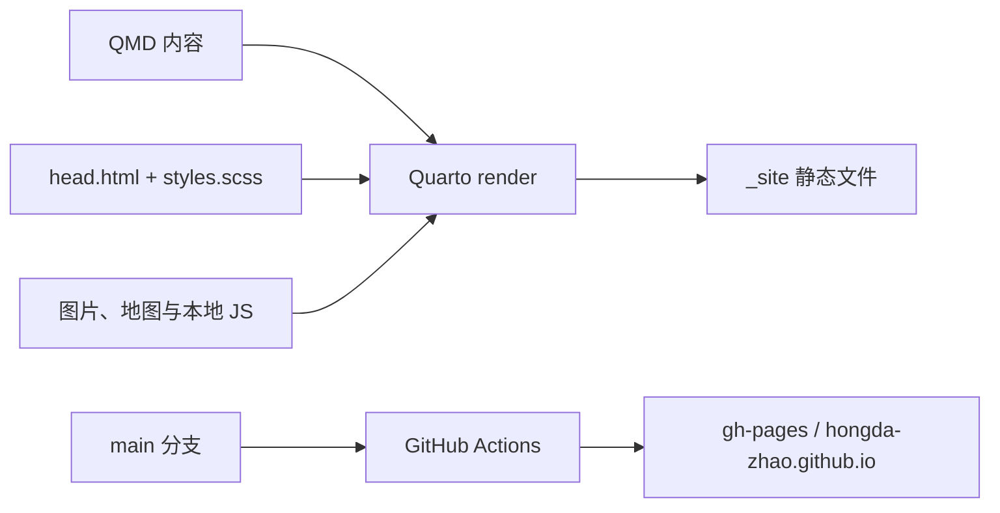

# 网站维护指南

> 本指南按 `origin/main` 的 `3ce5902`（2026-08-15）整理。网站结构或发布流程改变时，应在同一个 PR 中同步更新本文件。

## 1. 当前定位

这是一个以个人随笔为核心的双语静态网站，不是商业化作品集或完整 CV：

- 首页是一条按日期倒序排列的“生活、技术与研究随笔”。
- 较长的论文、会议和获奖记录放在独立的 `highlights/` 页面。
- Gallery 按地点组织照片，并用行政区地图辅助浏览。
- 默认语言为英文，用户可在左侧栏切换中文。
- 不使用顶部导航、内容分类、CV、About 长介绍或商业化卡片。

## 2. 架构与文件地图



| 内容 | 唯一来源 | 说明 |
|---|---|---|
| 站点设置与左侧栏 | `_quarto.yml` | 站点信息、外部链接、邮箱、语言按钮、Gallery 入口 |
| 视觉与响应式布局 | `styles.scss` | 白底、绿色强调、字体、侧栏、首页、详情页和 Gallery |
| 中英文与全站交互 | `head.html` | 翻译表、语言切换、邮箱还原、标题和灯箱无障碍标签 |
| 首页随笔 | `index.qmd` | 手工维护的时间线，不会自动收集其他页面 |
| 独立记录 | `highlights/<slug>/index.qmd` | 可用自有/获授权图片；无合适图片时使用文字记录档案 |
| 双语长文 | `posts/<slug>/index.qmd`、`posts/<slug>-en/index.qmd` | 中文与英文使用独立静态页面与语言专属成品图片 |
| 相册卡片 | `gallery.qmd` | 日期、图片、地点 key、alt key 和 12 栏布局 |
| 相册图片 | `assets/gallery/` | 去除元数据的 WebP |
| 相册行政区映射 | `assets/map/gallery-places.js` | 照片 ID、地区与 ISO 3166-2 行政区 |
| 地图运行时 | `assets/js/gallery-map.js` | 日常新增照片时不要修改 |
| 地图数据与素材 | `assets/map/`、`assets/vendor/` | 本地 Leaflet、Natural Earth 边界与底图 |
| 构建与预览 | `scripts/render.sh`、`scripts/preview.sh` | 优先使用系统 Quarto，否则使用本地工具副本 |
| 发布 | `.github/workflows/publish.yml` | `main` 更新后发布到 `gh-pages` |

`_site/` 和 `.quarto/` 是生成物与缓存，不是源代码。禁止手工编辑，正常任务不提交；只有用户明确要求交付生成产物时才例外。

`_quarto.yml` 中的 `project.render` 是公开发布的白名单，只允许首页、Gallery、`highlights/<slug>/index.qmd` 和 `posts/<slug>/index.qmd`。内部草稿、源数据、QA 记录与构建脚本不得放入这些路径；不要依赖“没有导航链接”来隐藏文件。`assets/map/README.md` 仅供仓库维护使用，地图资源规则只复制运行时 JS 与底图，不公开该说明文件。

## 3. 设计约束

- 视觉风格保持简洁、编辑式和学术笔记感：暖白纸张底（`#faf9f6`）、深灰正文、森林绿链接、细灰线；内容卡片不使用商业化阴影或大圆角，保留头像与地图标记现有的功能性圆形样式。
- 全站屏幕背景默认使用 32px 极淡绿色坐标网格，并在暖白底下叠加低对比度的公共领域牛皮纸纤维；高对比模式移除装饰背景，打印保持纯白。
- 桌面侧栏与移动抽屉使用同一纸纹染成深棕牛皮纸：姓名为奶油白、简介为燕麦米色、链接为淡鼠尾草绿、焦点与箭头为浅琥珀色；深色只用于导航表面，不延伸到主内容或页脚。
- 页面标题、章节标题和条目题名统一使用 `700` 粗体；日期、来源、图片说明、元数据与控件标签保持普通或半粗体，维持信息层级。
- 首页桌面端的大标题正常随页面滚动；标题离开视口后，在正文栏顶部显示紧凑的期刊式 running head。移动端复用 Quarto 顶部标题栏，不叠加第二层标题。
- 标题使用 Georgia/Times，正文使用系统无衬线字体；不要引入新的 Web font 或 UI 框架。
- 左侧栏顺序保持：猫头像与姓名 → 领域和一句简介 → 外部主页与邮箱 → 语言按钮 → Gallery。
- Google Scholar、LinkedIn 和 iNaturalist 使用获授权素材的品牌原色；GitHub 保持官方高对比单色，Email 与 Gallery 使用站点自身的导航色，不为追求“全彩”添加非官方品牌色。
- 首页每条记录的主标题都链接到本地 Highlight，并在下方单独保留可见的官方外部来源；首页只写事实性的一两句话，详细内容和证据放进 Highlight。
- 外部链接使用 `↗`、`target="_blank" rel="noopener noreferrer"`；站内链接使用 `→`。
- 期刊名使用 `<em lang="en">Journal Name</em>`；不要在翻译字符串内写 HTML。
- Highlight 保持“记录类型与日期 → 标题 → 获授权图片或文字记录档案 → 事实与证据链接 → 返回首页”的结构；没有合适图片时不要复制或热链外站图片，也不添加“待补充的个人记录”等批注。
- Gallery 顶部只显示中国、日本地图；澳大利亚和德国使用快捷按钮。地图标记跳到网页中的照片，点击照片才打开灯箱。
- 新布局必须在桌面和手机上成立，并保留键盘焦点、`prefers-reduced-motion` 和事实性 alt。

## 4. 常见更新

### 新增首页条目

1. 在 `index.qmd` 中按日期倒序插入完整的 `<article class="coverage-item">`，其中 `.coverage-record-link` 指向本地 Highlight，`.coverage-item-source` 指向官方外部来源。
2. 同时维护 `datetime="YYYY-MM-DD"` 与显示日期 `YYYY.MM.DD`。
3. 记录题名使用 `<h2 class="no-anchor">`；`no-anchor` 会阻止 Quarto 在站内链接内再注入标题锚点。
4. 在 `head.html` 添加英文和中文；日语原公告使用 `<small lang="ja">` 保留原文。
5. 站内主链接使用 `→`；官方来源使用 `↗`、`target="_blank" rel="noopener noreferrer"`，两者必须是独立链接，不能嵌套。

### 新增 Highlight

1. 复制结构最接近的 `highlights/<existing>/`，新目录使用小写 ASCII kebab-case。
2. 更新 front matter、日期、标题、正文和官方证据链接；没有可安全复用的图片时采用 `.highlight-docket` 文字档案。
3. 如有图片，写真实 `width`、`height`、英文 alt，并用 `data-i18n-alt` 提供中文 alt。
4. 可切换文字在 `head.html` 添加成对翻译；标题保留 `data-document-title`。
5. 在 `index.qmd` 手工增加对应站内条目；Highlight 不会自动出现在首页。

### 新增 Gallery 照片

每张照片必须同步四处：

1. `assets/gallery/YYYY-MM-DD-place-slug.webp`
2. `gallery.qmd` 中的完整 `<figure class="gallery-item">`
3. `assets/map/gallery-places.js` 中不带 `.webp` 的相同照片 ID
4. `head.html` 中的 `gallery.place.*` 与 `gallery.alt.*` 英中翻译

补充规则：

- Gallery 按地区、行政区和地点排列，不按拍摄日期排序；同一地点才用日期打破顺序。
- `gallery.qmd` 中地区照片数量的静态 fallback 文本也要同步；JavaScript 会在加载后再次根据地图数据计算数量。
- 同一行政区的照片放入同一个 `photos` 数组；`admin` 必须存在于 `admin1-regions.js`。
- 地图使用省、都道府县或州的行政标签中心，不保存精确拍摄坐标。
- 卡片源码只写日期与具体地点；脚本会补成“日期 · 国家 · 行政区 · 地点”。
- 桌面是 12 栏：默认 `6 + 6`，也可用 `five + seven`、`seven + five` 或 `wide`；手机统一单列。
- 中国、日本显示地图；澳大利亚、德国目前只计数并跳转到该地区第一张照片。
- 地图数据细节和扩展新国家的方法见 `assets/map/README.md`。

### 修改侧栏或外部链接

- 在 `_quarto.yml` 修改；图标使用 `assets/icons/` 中的本地副本。
- 邮箱必须继续拆成 `data-email-user` 和 `data-email-domain`，页面显示 `[at]`，不要写静态裸 `mailto:`。
- 不恢复 Blog / Research / Activities / About / CV 顶栏入口，除非用户明确提出新的信息架构。

## 5. 双语规则

- `head.html` 的翻译格式固定为 `"key": ["English", "中文"]`，默认英文。
- 可见文字使用 `data-i18n`，ARIA 使用 `data-i18n-aria-label`，图片使用 `data-i18n-alt`。
- 语言脚本通过 `textContent` 写入文字，因此含 `<em>`、链接或其他标记的句子必须拆成 before/after key。
- 新增的页面级标题使用 `data-document-title`，让浏览器标题与移动端标题同步切换。
- 翻译时以期刊、大学、奖项和会议的官方名称为准，不从日语标题机械直译。
- 含大量 Markdown、链接、代码和图表的长文不放入全站 `data-i18n` 字典；中文与英文正文分别放在 `posts/<slug>/` 和 `posts/<slug>-en/`，两者都符合公开页面白名单。
- 双语长文必须各自声明 `lang`、self canonical、语言专属社交元数据，并通过 `hreflang="en"`、`hreflang="zh-CN"` 和 `x-default` 互相指向；正文顶部保留可见的对向语言链接。
- 首页的长文主链接应以英文 URL 作为无 JavaScript fallback，并由 `data-i18n-href` 随界面语言切换到中文 URL。
- 图内有文字时不能只翻译 alt 和图注；应分别提供经过核对的语言专属成品，并且只提交页面实际引用的文件格式。生成脚本、源数据和 QA 记录继续放在公开发布白名单之外。

## 6. 图片、隐私与版权

- 文件名使用小写 ASCII kebab-case；Gallery 使用 `YYYY-MM-DD-place-slug.webp`。
- 普通照片优先转为 WebP 并去除 EXIF、GPS、XMP；带小字的论文图可保留优化 PNG。
- 群体照公开前确认参与者同意；办公室照片检查屏幕、纸张、工牌和未发表数据。
- Alt 描述画面，不猜测物种或写出无必要的人名。
- 地图、品牌图标和第三方图片保留可追溯来源；当前来源见 `assets/map/README.md` 与 `assets/README.md`。

## 7. 验证与发布

```bash
./scripts/preview.sh   # 本地实时预览
./scripts/render.sh    # 完整构建
git diff --check       # 空白与补丁检查
```

发布前至少检查：

- 首页、Gallery 和一个嵌套 Highlight。
- 桌面与手机宽度，无横向溢出。
- 默认英文和中文切换；可见文字、ARIA 与 alt 都能更新。
- 图片、内部链接、外部链接与浏览器标题。
- `_site/sitemap.xml`、`_site/search.json` 与输出目录只包含 `project.render` 白名单中的正式页面；内部文件名和已删除路由均不存在。
- Gallery 卡片、图片文件、地图 photo ID、admin code 和翻译 key 一一对应。
- 地图计数、行政区着色、标记滚动、快捷按钮和灯箱顺序。
- `git status` 中没有 `_site/`、`.quarto/`、桌面原图或无关文件。

仓库改动遵循 `AGENTS.md`：从最新 `main` 建立 `codex/*` 分支，验证后自动创建 Draft PR；不要直接推送、force-push 或合并 `main`。

## 8. 内部模板与发布边界

- `projects.qmd`、`publications.qmd` 及其占位文案已删除。未来只有在内容完成时，才新建页面并同时加入 `project.render`。
- 正式文章目录只保留 `index.qmd` 与它实际引用的成品图片；不把 review draft、figure QA、绘图脚本、源数据或未引用的输出格式放在可发布的文章目录中。
- 新建正式文章时使用 `posts/<slug>/index.qmd`；如需写作模板或内部工作记录，应放在 `posts/` 与 `highlights/` 之外的非发布目录。

## 9. 新对话使用方式

新的 Codex 对话可以直接使用下面的开场：

```text
请先阅读仓库根目录的 AGENTS.md 和 .github/MAINTENANCE.md，再根据我的要求修改网站。
保持现有的简洁双语个人笔记设计；修改后完成本地构建与浏览器检查，并按仓库规则创建 Draft PR。
```
