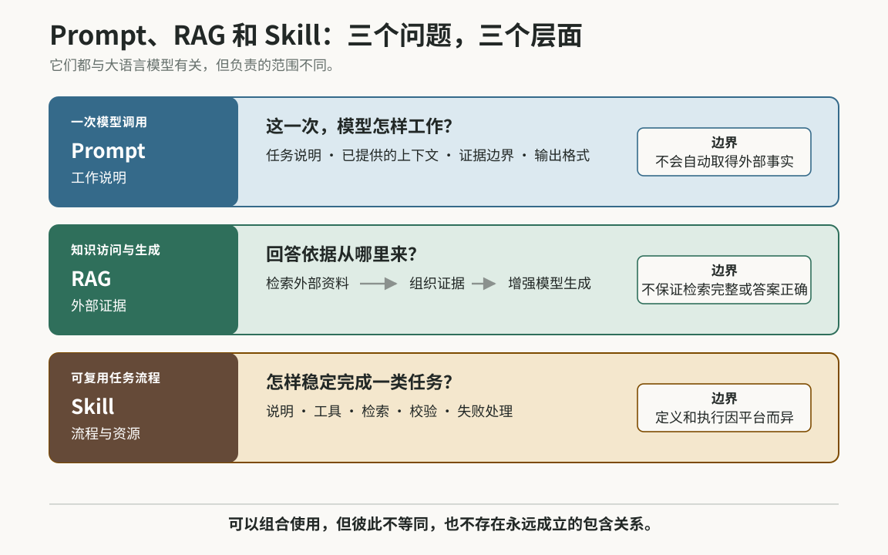
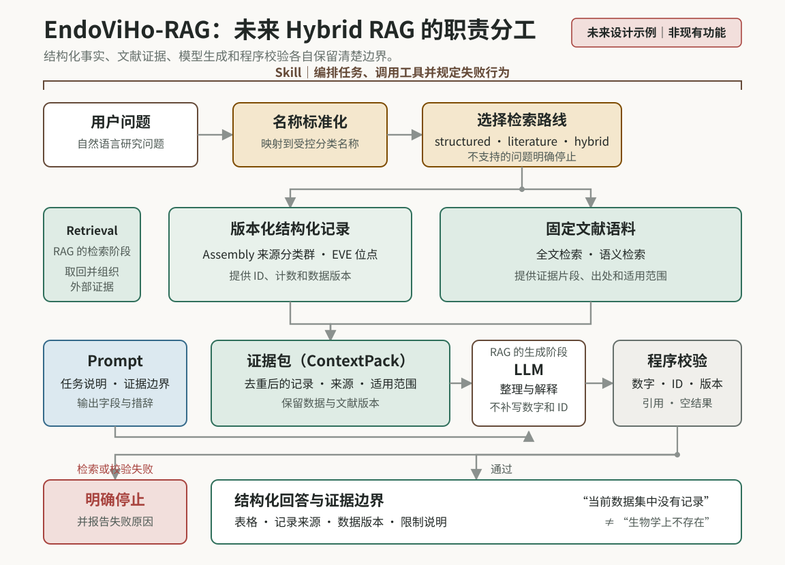

<style>
#quarto-document-content .article-figure { margin: 1.8rem 0; }
#quarto-document-content .figure-scroll {
  max-width: 100%;
  overflow-x: auto;
  overscroll-behavior-inline: contain;
  -webkit-overflow-scrolling: touch;
}
#quarto-document-content .figure-zoom { display: block; }
#quarto-document-content .figure-zoom img {
  display: block;
  width: 100%;
  height: auto;
}
#quarto-document-content .article-figure figcaption {
  margin-top: 0.6rem;
  color: #66706c;
  font-size: 0.9rem;
  line-height: 1.5;
}
@media (max-width: 767.98px) {
  #quarto-document-content .figure-scroll img {
    width: 900px;
    max-width: none;
  }
}
</style>

EndoViHo-RAG 是我正在搭建的一个面向内源性病毒元件（endogenous viral element，EVE）的可审计 Hybrid RAG。它希望把基因组组装（Assembly）层面或者是物种层面的内源化病毒的结构化记录与文献证据放进同一套查询流程中。

最近学习设计AI工具时反复遇到Prompt、RAG 和 Skill 这三个词。它们经常被放在一起讨论，但真正开始搭系统后，在这里我打算进行一下讨论。

这三个词听起来都像是在描述“怎样让大语言模型完成任务”，也很容易被混在一起。对我来说，最有用的区分是看它们分别回答什么问题：

- **Prompt：**这一次，要模型做什么、依据什么、怎样表达；
- **RAG：**回答之前，到哪里取得与问题相关的外部证据；
- **Skill：**怎样把一类任务所需的说明、工具和检查步骤组织成可重复使用的流程。

这不是一套严格的行业分类。尤其是 Skill，不同平台对它的定义并不完全相同。不过，对我正在做的科研工具来说，这个区分很实用。

<figure class="article-figure">
<div class="figure-scroll">
<a class="figure-zoom" href="figures/figure-1-prompt-rag-skill.svg" target="_blank" rel="noopener" aria-label="在新标签页打开图 1 的完整 SVG"></a>
</div>
<figcaption>图 1｜本文采用的工作区分。Prompt 管一次调用，RAG 管外部证据怎样进入生成上下文，Skill 管一类任务怎样被稳定复用；这不是统一的行业分层标准。</figcaption>
</figure>

## Prompt：规定这一次模型要怎样工作

Prompt 是模型在一次调用中收到的任务说明和上下文。平时我们说“写 Prompt”，通常是指写给模型的那部分指令。

例如：

```text
只根据系统返回的记录回答问题。
列出 Assembly 来源分类群、Assembly 编号、当前数据版本纳入的去重后 EVE 位点（loci）数量和支持证据。
如果没有检索到记录，请写“当前数据集中没有记录”，不要写成“生物学上不存在”。
```

这段 Prompt 同时规定了任务、证据边界、输出字段和措辞。它不只是控制语气，也可以限制回答范围、指定格式，并告诉模型遇到不确定情况时应怎样处理。

但 Prompt 有一个很清楚的边界：它可以携带已经提供给模型的数据，却不会因为写了“请准确查询”就自动获得数据库访问能力。

同样，“不要猜测”是一条重要指令，但不是可靠的技术保证。数据权限、字段校验、数字核对和出错时停止，仍然需要程序来完成。

所以，我现在更愿意把 Prompt 理解为本次模型调用的**工作说明**，而不是知识来源。

## RAG：先取得证据，再让模型回答

RAG 是 [Retrieval-Augmented Generation](https://arxiv.org/abs/2005.11401)，通常译作“检索增强生成”。它的核心不是某一种数据库，而是一种系统工作方式：在模型生成答案之前，先取回与问题有关的外部资料，再把这些资料放进生成上下文。

最基本的流程是：

```text
用户问题
   ↓
检索数据库、文献或其他资料
   ↓
选择并组织相关证据
   ↓
把证据交给大语言模型
   ↓
生成带有证据边界的回答
```

这里的检索不一定依赖向量数据库。它可以来自 SQL、全文检索、知识图谱、网页、API、实验室内部数据，也可以把几种方式组合起来。

需要注意的是，“接入数据库”并不自动等于 RAG。如果系统执行 SQL 后直接返回一张表，那是数据库查询；当取回的记录被组织成上下文，并用于增强后续的自然语言生成时，才符合 RAG 的核心含义。

这个区别对 EndoViHo-RAG 很重要。我希望把版本化的结构化记录作为事实层，把文献内容作为解释和证据来源。Assembly 编号、记录数量和数据版本不应该由模型补写；模型的工作是根据取回的内容整理问题、解释结果，并清楚标出证据边界。

RAG 也不是“事实保险”。检索可能漏掉资料、选错资料，来源本身也可能有问题。它真正带来的价值，是让回答可以回到具体记录和文献重新检查。

## Skill：把一类任务变成可重复调用的流程

Skill 不是像 RAG 那样有相对明确来源的学术方法，各个平台对它能包含什么、怎样执行，都可能有不同约定。

本文所说的 Skill，是 AI Agent 工具链中的一个**可复用任务包**。它可以包含：

- 任务说明和 Prompt；
- SQL、Python 程序或 API 调用；
- RAG 所需的检索步骤；
- 受控词表、参考资料和输入输出格式；
- 去重、完整性检查和失败规则。

因此，Skill 更像一套供 Agent 调用或遵循的任务流程及配套资源，而不是一句更长的 Prompt。

例如，将来可以为 EndoViHo-RAG 设计一个“查询 EVE 记录与 Assembly 来源分类群之间关系”的 Skill。它可以先把用户输入映射到受控的分类名称，再选择结构化查询、文献检索或混合路线，随后完成去重、统计、结果校验和表格输出。任何关键步骤失败时，流程都应明确停止，而不是让模型凭常识补齐缺失结果。

一个 Skill 不一定要使用 RAG，也不一定需要复杂程序。翻译固定格式的文字可能只需要 Prompt；而一项需要反复执行、调用多个工具并检查结果的任务，才更适合封装成 Skill。

## 三者怎样配合

Prompt、RAG 和 Skill 不是三个互相替代的选项。它们可以单独出现，也可以在同一套系统中分工合作。

下面是 EndoViHo-RAG 未来可能采用的一种流程。图中的 Skill 负责组织任务，Prompt 和检索是其中按需调用的环节：

<figure class="article-figure">
<div class="figure-scroll">
<a class="figure-zoom" href="figures/figure-2-endoviho-future-workflow.svg" target="_blank" rel="noopener" aria-label="在新标签页打开图 2 的完整 SVG"></a>
</div>
<figcaption>图 2｜EndoViHo-RAG 的未来设计示例（非现有功能）。Skill 负责编排；Retrieval 是 RAG 的检索阶段，取回的证据随后用于增强模型生成；Prompt 约束一次模型调用，数字与标识符仍需程序校验。</figcaption>
</figure>

这个关系不能简单画成一棵永远成立的包含树。Prompt 可以独立使用，RAG 可以不被封装成 Skill，Skill 也可以完全不做检索。

## 用 EndoViHo-RAG 的一个问题来拆解

EndoViHo-RAG 目前仍处于早期开发阶段，领域数据、检索路线和可调用的 Skill 尚未完成。下面不是现有功能演示，而是一个用于说明职责分工的设计例子。

假设未来已经导入并发布了相应数据，用户提出：

> 在当前发布的数据中，哪些来源于双壳类（Bivalvia）的基因组 Assembly 收录了与 Orthopolintovirales 相关的 EVE 位点？每个 Assembly 有多少个去重后的位点？

这里使用“数据中收录了 EVE 位点”，而不是直接说“发现了病毒”。Assembly 的来源分类群也不自动等于已经证明的感染宿主。这些措辞本身就是证据边界的一部分。

在这个问题中，**Prompt** 负责规定回答规则，例如：

- 只根据系统返回的记录作答；
- 输出 Assembly 来源分类群、Assembly 编号、去重后的 EVE 位点数量和证据来源；
- 保留数据集与文献版本；
- 不把“没有记录”解释为“生物学上不存在”。

**Retrieval / RAG** 负责取得回答所需的依据，例如：

- 从版本化数据库中检索结构化记录；
- 从固定文献语料中取回相关证据；
- 把记录、来源和适用范围组织成模型可以使用的上下文。

**Skill** 则可以把完整流程串起来：

```text
理解问题
→ 标准化分类名称
→ 选择结构化、文献或混合检索路线
→ 执行查询
→ 去重和汇总
→ 核对数字、ID 与来源
→ 生成表格
→ 输出解释和限制
```

这个例子也说明，科研 RAG 的关键不只是“能回答”。更重要的是：答案中的每个数字和判断能不能回到数据版本、记录和文献，检索失败与真正的空结果能不能被区分。

## 三个容易混淆的边界

- **很长的 Prompt 仍然只是 Prompt。** 写入背景知识，不等于系统会在运行时检索外部证据。
- **连上数据库也不一定是 RAG。** 查询结果只有参与后续生成，才构成完整的检索增强生成过程。
- **保存一组 Prompt 也不一定形成了 Skill。** 对 EndoViHo-RAG 这类需要复查的科研任务，我希望 Skill 进一步明确输入、工具、输出、校验方式和失败行为。
- **RAG 给出了引用，也不代表答案一定正确。** 可追溯让错误更容易被发现和修正，但不会自动消除错误。

## 我现在怎样区分它们

| 概念 | 所在层面 | 主要解决的问题 | 它不能单独保证什么 |
|---|---|---|---|
| Prompt | 一次模型交互 | 这一次做什么、依据什么、怎样输出 | 主动获得外部事实，或把文字约束变成硬性保证 |
| RAG | 知识访问与生成架构 | 回答所需的证据从哪里来、怎样进入上下文 | 检索一定完整、来源一定正确、答案一定真实 |
| Skill | 可复用任务流程 | 怎样稳定地重复完成一整类任务 | 跨平台通用，或流程运行后自然得到正确结论 |

如果只是希望模型按固定方式回答，我会先写 Prompt；如果答案必须依赖外部、更新频繁或需要追溯的资料，我会设计 Retrieval 或 RAG；如果同一任务会反复出现，而且包含多个工具、检查步骤和失败条件，我会进一步把它封装成 Skill。
