```{=html}
<div class="page-shell gallery-page">
  <div class="visually-hidden" role="heading" aria-level="1" data-i18n="gallery.title" data-document-title>Gallery</div>

  <section class="gallery-map-panel" aria-label="Photograph location maps" data-i18n-aria-label="gallery.map.sectionAria">
    <a class="gallery-map-skip" href="#gallery-grid" data-i18n="gallery.map.skip">Skip maps and browse photographs by location</a>

    <div class="gallery-atlas" id="gallery-atlas" role="group" aria-label="Regional maps of photograph locations" data-i18n-aria-label="gallery.map.aria">
      <article class="gallery-region gallery-region--china">
        <header class="gallery-region-header">
          <h2 id="gallery-region-china-title" data-i18n="gallery.map.region.china">China</h2>
          <span class="gallery-region-count" data-gallery-region-count="china">12 photographs</span>
        </header>
        <div id="gallery-map-china" class="gallery-map gallery-map--china" data-gallery-region="china" role="region" tabindex="-1" aria-label="Photograph locations in China" data-i18n-aria-label="gallery.map.region.chinaAria">
          <p class="gallery-map-loading" data-i18n="gallery.map.loading">Drawing the map…</p>
        </div>
      </article>

      <article class="gallery-region gallery-region--japan">
        <header class="gallery-region-header">
          <h2 id="gallery-region-japan-title" data-i18n="gallery.map.region.japan">Japan</h2>
          <span class="gallery-region-count" data-gallery-region-count="japan">19 photographs</span>
        </header>
        <div id="gallery-map-japan" class="gallery-map gallery-map--japan" data-gallery-region="japan" role="region" tabindex="-1" aria-label="Photograph locations in Japan" data-i18n-aria-label="gallery.map.region.japanAria">
          <p class="gallery-map-loading" data-i18n="gallery.map.loading">Drawing the map…</p>
        </div>
      </article>
    </div>

    <div class="gallery-region-shortcuts" role="group" aria-label="Other photograph regions" data-i18n-aria-label="gallery.map.shortcutsAria">
      <button class="gallery-region-shortcut" type="button" data-gallery-open-region="australia">
        <span class="gallery-region-shortcut-name" data-i18n="gallery.map.region.australia">Australia</span>
        <span class="gallery-region-shortcut-count" data-gallery-region-count="australia">2 photographs</span>
        <span class="gallery-region-shortcut-arrow" aria-hidden="true">→</span>
      </button>
      <button class="gallery-region-shortcut" type="button" data-gallery-open-region="europe">
        <span class="gallery-region-shortcut-name" data-i18n="gallery.map.region.europe">Germany</span>
        <span class="gallery-region-shortcut-count" data-gallery-region-count="europe">2 photographs</span>
        <span class="gallery-region-shortcut-arrow" aria-hidden="true">→</span>
      </button>
    </div>

    <noscript><p class="gallery-map-noscript">The map requires JavaScript. Browse the photographs below.</p></noscript>
  </section>

  <div class="gallery-grid" id="gallery-grid">
    <!-- China -->
    <figure class="gallery-item gallery-item--five">
      <a class="gallery-lightbox lightbox" href="assets/gallery/2025-06-08-canton-tower.webp" data-gallery="photo-gallery">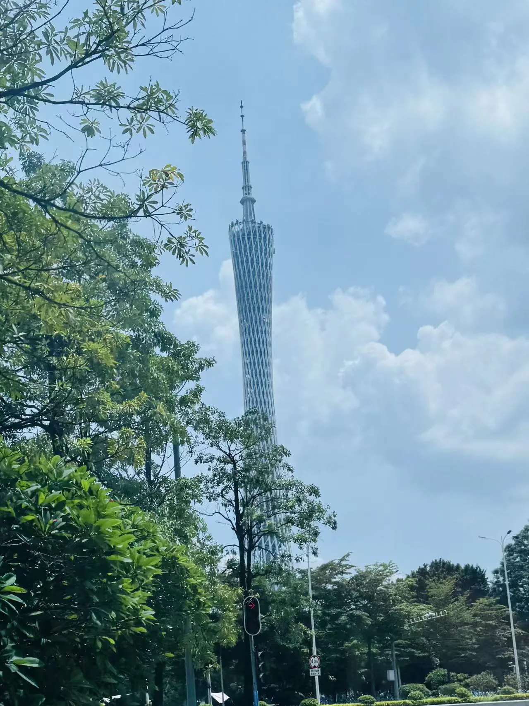</a>
      <figcaption class="gallery-caption"><time datetime="2025-06-08">2025.06.08</time><span aria-hidden="true">·</span><span data-i18n="gallery.place.cantonTower">Canton Tower, Guangzhou</span></figcaption>
    </figure>
    <figure class="gallery-item gallery-item--seven">
      <a class="gallery-lightbox lightbox" href="assets/gallery/2025-06-05-shantou.webp" data-gallery="photo-gallery">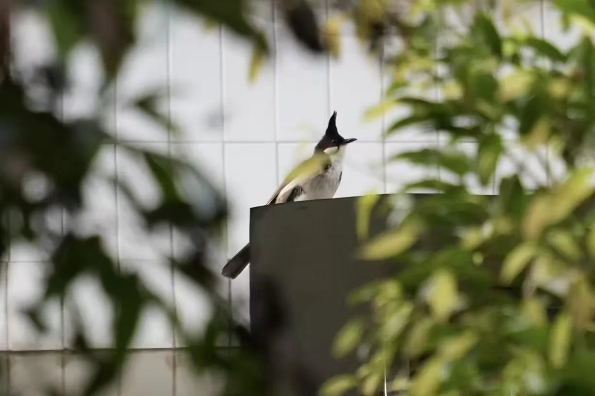</a>
      <figcaption class="gallery-caption"><time datetime="2025-06-05">2025.06.05</time><span aria-hidden="true">·</span><span data-i18n="gallery.place.shantou">Shantou</span></figcaption>
    </figure>
    <figure class="gallery-item gallery-item--seven">
      <a class="gallery-lightbox lightbox" href="assets/gallery/2026-07-08-gansu.webp" data-gallery="photo-gallery">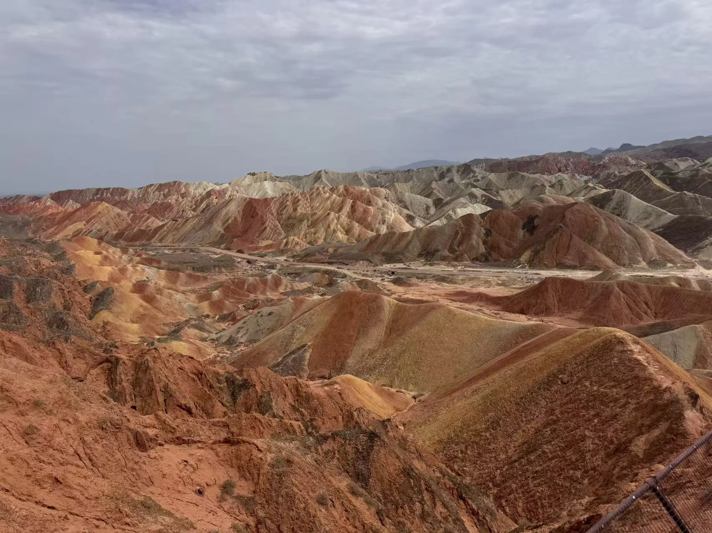</a>
      <figcaption class="gallery-caption"><time datetime="2026-07-08">2026.07.08</time><span aria-hidden="true">·</span><span data-i18n="gallery.place.gansu">Zhangye Colorful Danxia Scenic Area</span></figcaption>
    </figure>
    <figure class="gallery-item gallery-item--five">
      <a class="gallery-lightbox lightbox" href="assets/gallery/2023-08-08-qinhuangdao.webp" data-gallery="photo-gallery">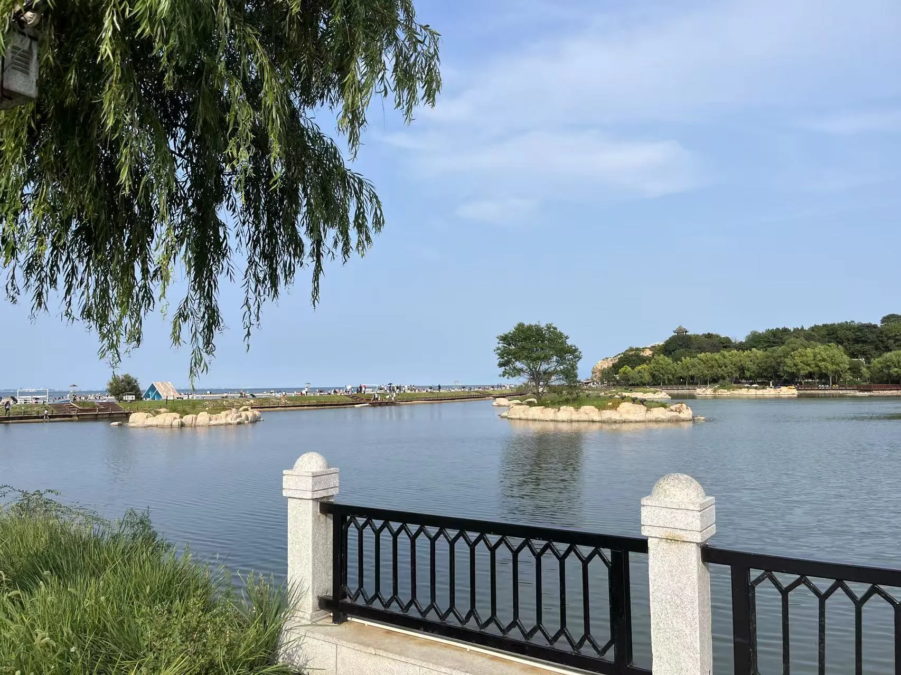</a>
      <figcaption class="gallery-caption"><time datetime="2023-08-08">2023.08.08</time><span aria-hidden="true">·</span><span data-i18n="gallery.place.qinhuangdao">Pigeon Nest Park, Qinhuangdao</span></figcaption>
    </figure>
    <figure class="gallery-item gallery-item--five">
      <a class="gallery-lightbox lightbox" href="assets/gallery/2026-02-26-nanjing-museum.webp" data-gallery="photo-gallery">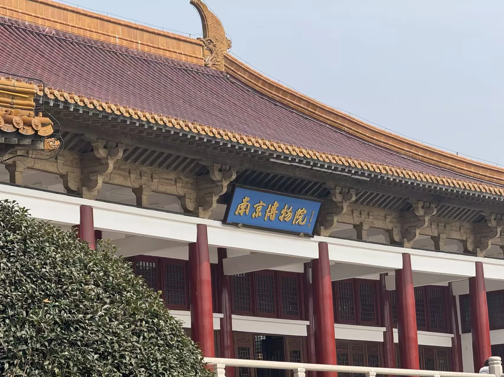</a>
      <figcaption class="gallery-caption"><time datetime="2026-02-26">2026.02.26</time><span aria-hidden="true">·</span><span data-i18n="gallery.place.nanjingMuseum">Nanjing Museum</span></figcaption>
    </figure>
    <figure class="gallery-item gallery-item--seven">
      <a class="gallery-lightbox lightbox" href="assets/gallery/2023-08-15-chifeng.webp" data-gallery="photo-gallery">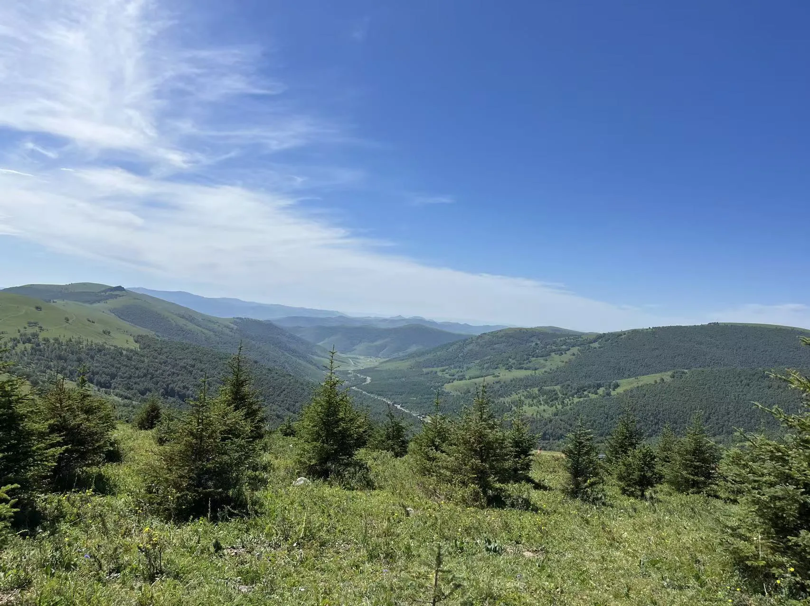</a>
      <figcaption class="gallery-caption"><time datetime="2023-08-15">2023.08.15</time><span aria-hidden="true">·</span><span data-i18n="gallery.place.chifeng">Chifeng</span></figcaption>
    </figure>
    <figure class="gallery-item gallery-item--seven">
      <a class="gallery-lightbox lightbox" href="assets/gallery/2026-07-06-qinghai.webp" data-gallery="photo-gallery">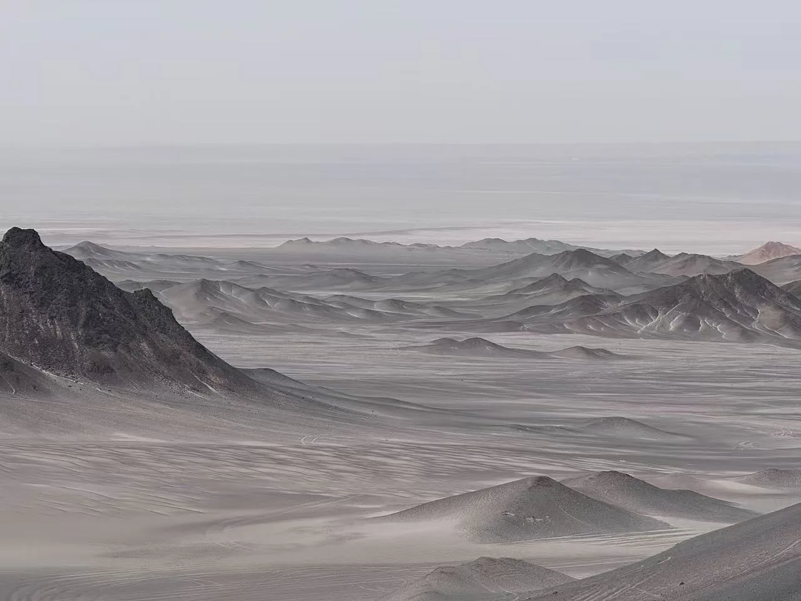</a>
      <figcaption class="gallery-caption"><time datetime="2026-07-06">2026.07.06</time><span aria-hidden="true">·</span><span data-i18n="gallery.place.qinghai">Heidu Mountain Scenic Area, Mangya</span></figcaption>
    </figure>
    <figure class="gallery-item gallery-item--five">
      <a class="gallery-lightbox lightbox" href="assets/gallery/2026-07-10-jinan-pearl-spring.webp" data-gallery="photo-gallery">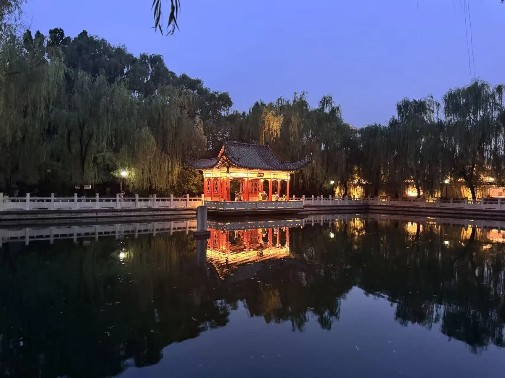</a>
      <figcaption class="gallery-caption"><time datetime="2026-07-10">2026.07.10</time><span aria-hidden="true">·</span><span data-i18n="gallery.place.jinanPearlSpring">Pearl Spring, Jinan</span></figcaption>
    </figure>
    <figure class="gallery-item gallery-item--five">
      <a class="gallery-lightbox lightbox" href="assets/gallery/2025-02-22-shanghai-jiao-tong-minhang.webp" data-gallery="photo-gallery">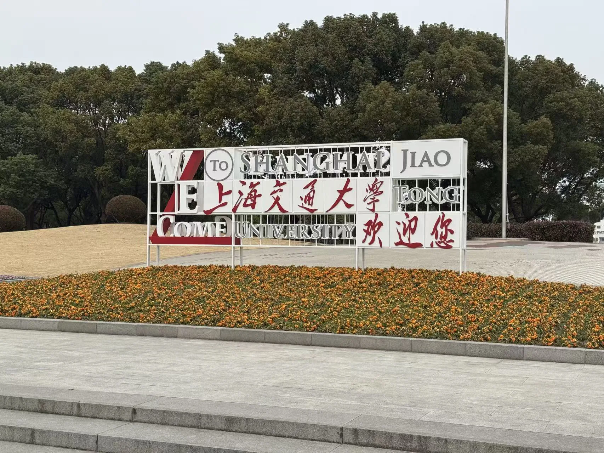</a>
      <figcaption class="gallery-caption"><time datetime="2025-02-22">2025.02.22</time><span aria-hidden="true">·</span><span data-i18n="gallery.place.shanghaiJiaoTong">Shanghai Jiao Tong University, Minhang Campus</span></figcaption>
    </figure>
    <figure class="gallery-item gallery-item--seven">
      <a class="gallery-lightbox lightbox" href="assets/gallery/2025-03-01-taiyuan-ancient-county-town.webp" data-gallery="photo-gallery">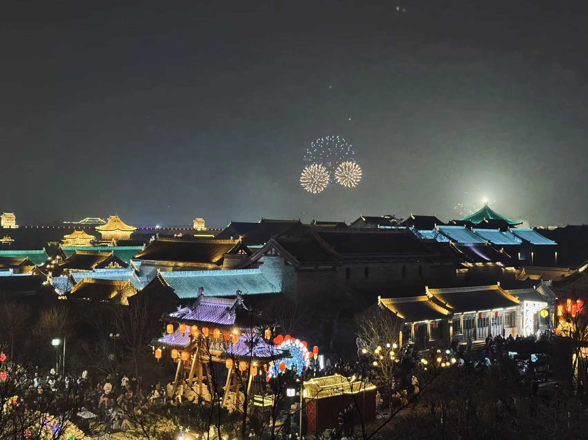</a>
      <figcaption class="gallery-caption"><time datetime="2025-03-01">2025.03.01</time><span aria-hidden="true">·</span><span data-i18n="gallery.place.taiyuanAncientTown">Taiyuan Ancient County</span></figcaption>
    </figure>
    <figure class="gallery-item gallery-item--five">
      <a class="gallery-lightbox lightbox" href="assets/gallery/2025-03-15-tianjin-century-clock.webp" data-gallery="photo-gallery">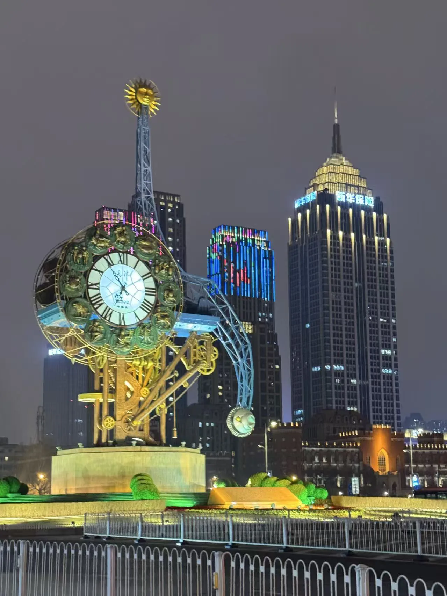</a>
      <figcaption class="gallery-caption"><time datetime="2025-03-15">2025.03.15</time><span aria-hidden="true">·</span><span data-i18n="gallery.place.tianjinCenturyClock">Tianjin Century Clock</span></figcaption>
    </figure>
    <figure class="gallery-item gallery-item--seven">
      <a class="gallery-lightbox lightbox" href="assets/gallery/2025-02-24-hangzhou-west-lake.webp" data-gallery="photo-gallery">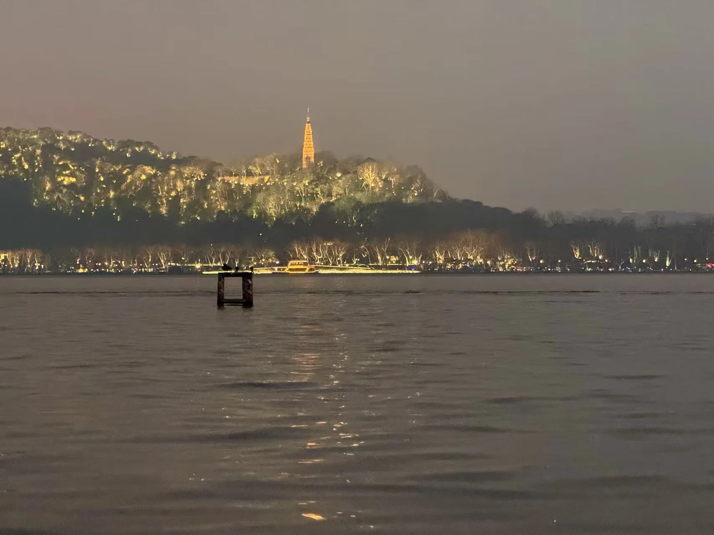</a>
      <figcaption class="gallery-caption"><time datetime="2025-02-24">2025.02.24</time><span aria-hidden="true">·</span><span data-i18n="gallery.place.hangzhouWestLake">West Lake and Leifeng Pagoda, Hangzhou</span></figcaption>
    </figure>

    <!-- Japan -->
    <figure class="gallery-item gallery-item--five">
      <a class="gallery-lightbox lightbox" href="assets/gallery/2026-02-02-otaru.webp" data-gallery="photo-gallery">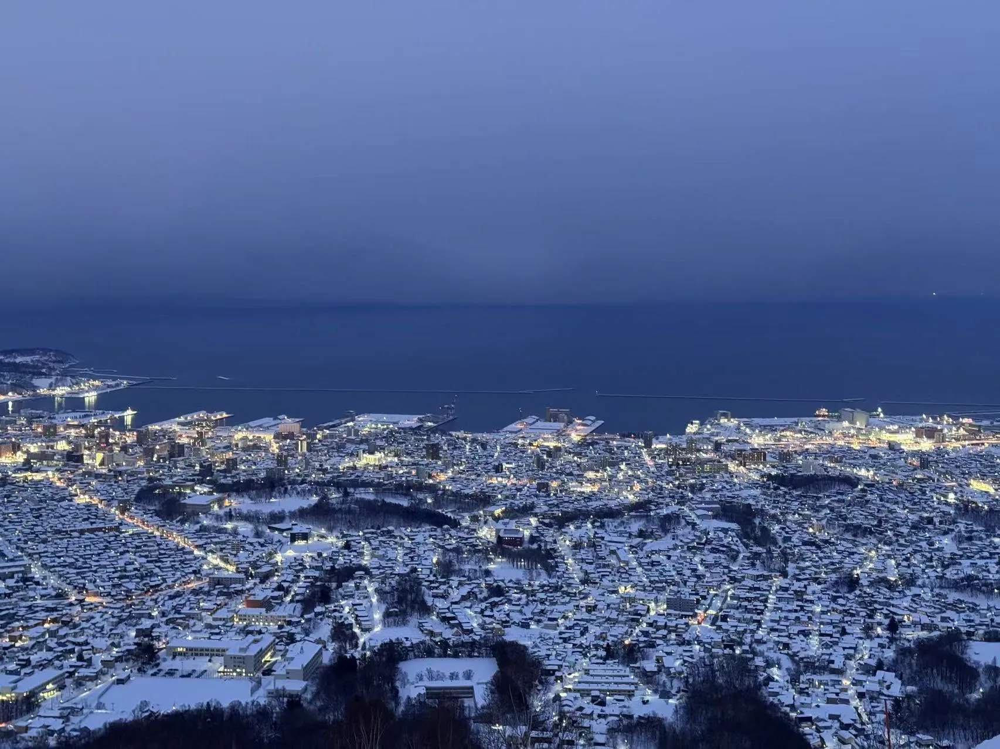</a>
      <figcaption class="gallery-caption"><time datetime="2026-02-02">2026.02.02</time><span aria-hidden="true">·</span><span data-i18n="gallery.place.otaru">Mount Tengu, Otaru</span></figcaption>
    </figure>
    <figure class="gallery-item gallery-item--seven">
      <a class="gallery-lightbox lightbox" href="assets/gallery/2023-01-06-noboribetsu.webp" data-gallery="photo-gallery">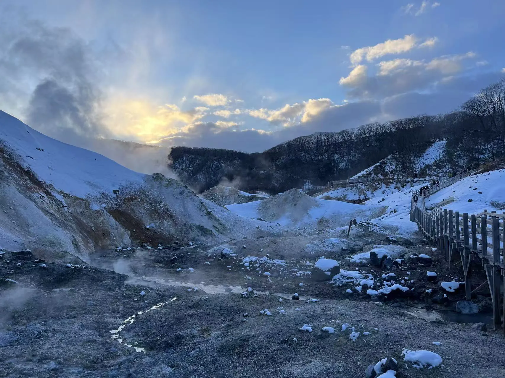</a>
      <figcaption class="gallery-caption"><time datetime="2023-01-06">2023.01.06</time><span aria-hidden="true">·</span><span data-i18n="gallery.place.noboribetsu">Noboribetsu Jigokudani</span></figcaption>
    </figure>
    <figure class="gallery-item gallery-item--wide">
      <a class="gallery-lightbox lightbox" href="assets/gallery/2024-01-29-shiretoko.webp" data-gallery="photo-gallery">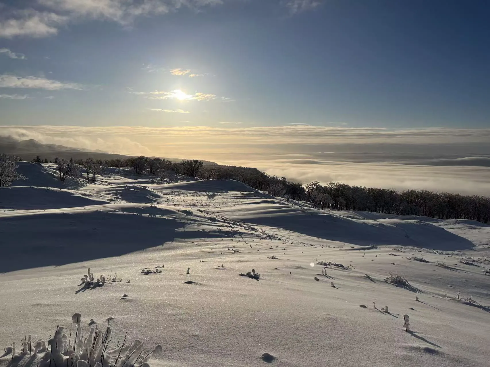</a>
      <figcaption class="gallery-caption"><time datetime="2024-01-29">2024.01.29</time><span aria-hidden="true">·</span><span data-i18n="gallery.place.shiretoko">Shiretoko Goko Lakes</span></figcaption>
    </figure>
    <figure class="gallery-item gallery-item--five">
      <a class="gallery-lightbox lightbox" href="assets/gallery/2024-01-27-tokyo.webp" data-gallery="photo-gallery">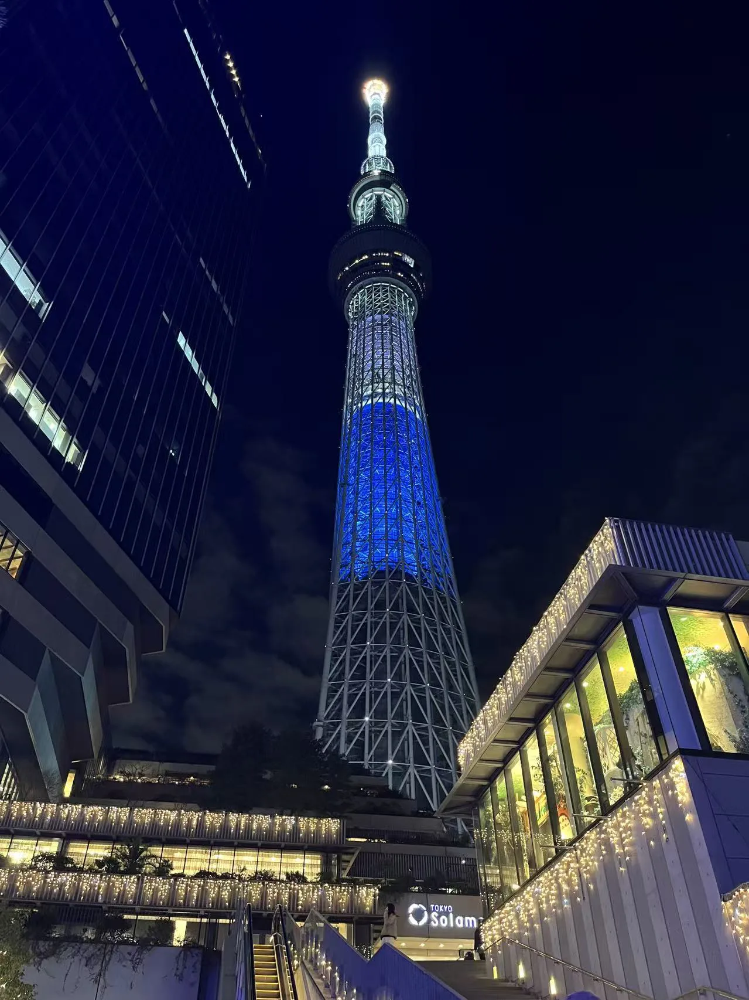</a>
      <figcaption class="gallery-caption"><time datetime="2024-01-27">2024.01.27</time><span aria-hidden="true">·</span><span data-i18n="gallery.place.tokyo">Tokyo Skytree</span></figcaption>
    </figure>
    <figure class="gallery-item gallery-item--seven">
      <a class="gallery-lightbox lightbox" href="assets/gallery/2025-09-15-wakasa.webp" data-gallery="photo-gallery">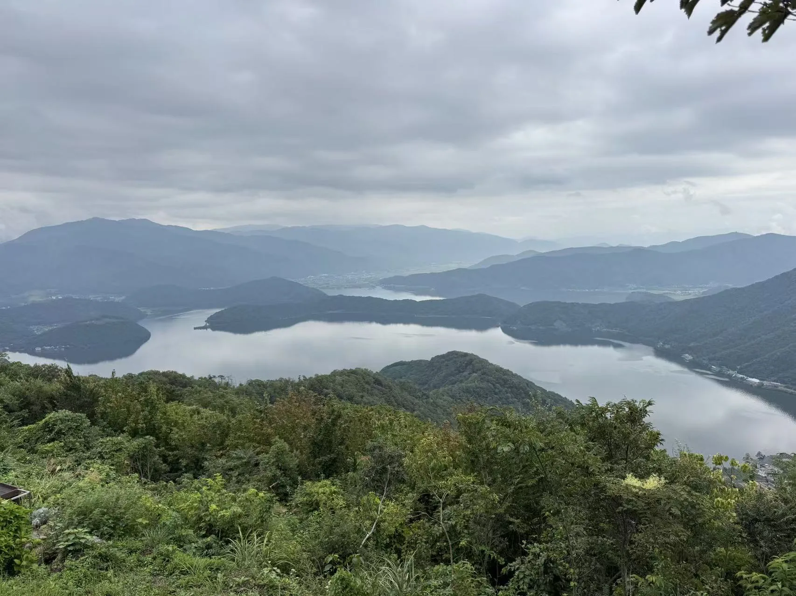</a>
      <figcaption class="gallery-caption"><time datetime="2025-09-15">2025.09.15</time><span aria-hidden="true">·</span><span data-i18n="gallery.place.wakasa">Rainbow Line Summit Park, Wakasa</span></figcaption>
    </figure>
    <figure class="gallery-item gallery-item--wide">
      <a class="gallery-lightbox lightbox" href="assets/gallery/2023-11-02-lake-tateshina.webp" data-gallery="photo-gallery">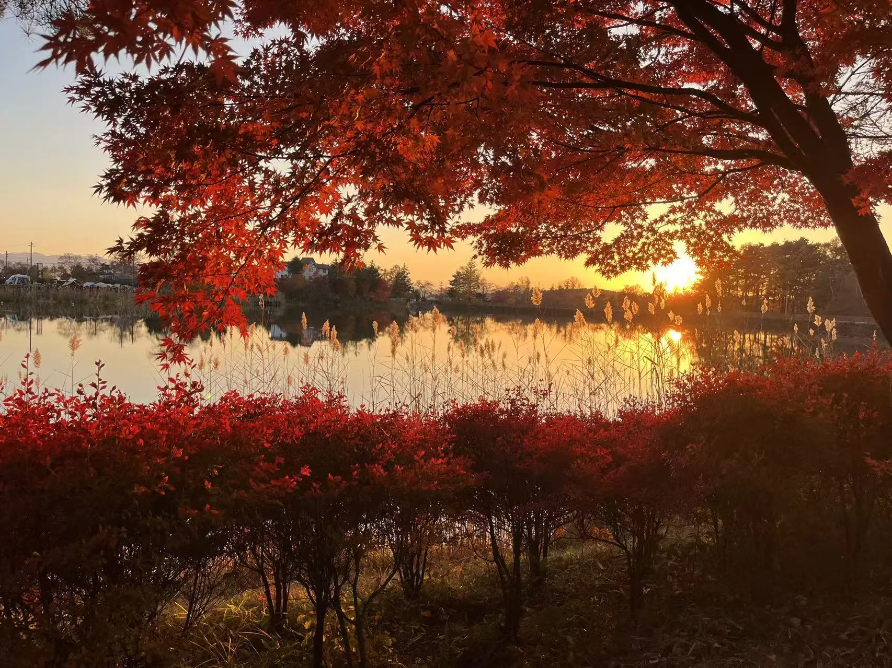</a>
      <figcaption class="gallery-caption"><time datetime="2023-11-02">2023.11.02</time><span aria-hidden="true">·</span><span data-i18n="gallery.place.tateshina">Lake Tateshina, Chino</span></figcaption>
    </figure>
    <figure class="gallery-item gallery-item--seven">
      <a class="gallery-lightbox lightbox" href="assets/gallery/2026-01-07-tateishi-park.webp" data-gallery="photo-gallery">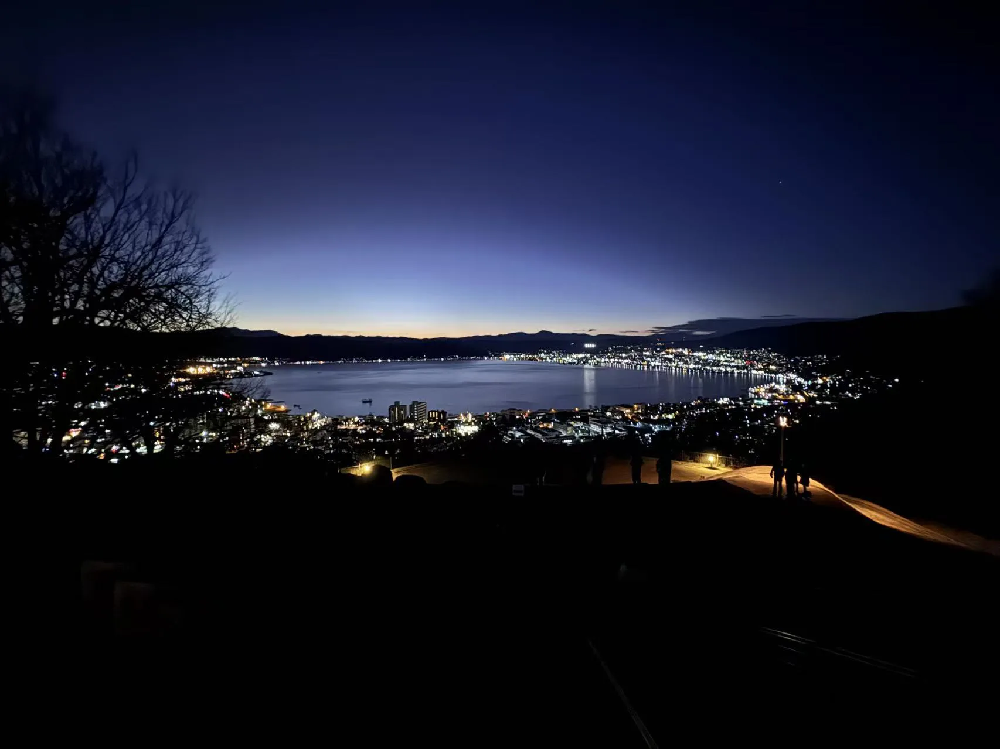</a>
      <figcaption class="gallery-caption"><time datetime="2026-01-07">2026.01.07</time><span aria-hidden="true">·</span><span data-i18n="gallery.place.tateishi">Tateishi Park, Suwa</span></figcaption>
    </figure>
    <figure class="gallery-item gallery-item--five">
      <a class="gallery-lightbox lightbox" href="assets/gallery/2023-11-02-tateishi-park.webp" data-gallery="photo-gallery">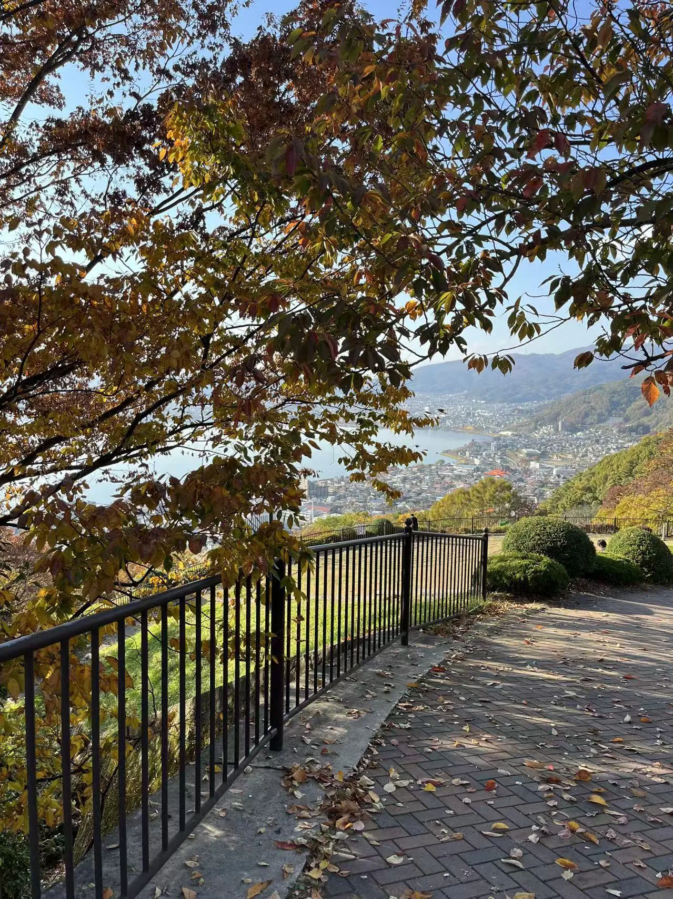</a>
      <figcaption class="gallery-caption"><time datetime="2023-11-02">2023.11.02</time><span aria-hidden="true">·</span><span data-i18n="gallery.place.tateishi">Tateishi Park, Suwa</span></figcaption>
    </figure>
    <figure class="gallery-item gallery-item--five">
      <a class="gallery-lightbox lightbox" href="assets/gallery/2026-06-07-shima.webp" data-gallery="photo-gallery">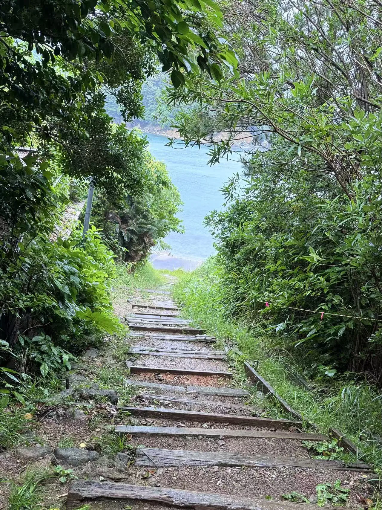</a>
      <figcaption class="gallery-caption"><time datetime="2026-06-07">2026.06.07</time><span aria-hidden="true">·</span><span data-i18n="gallery.place.shima">Dolphin Island, Toba</span></figcaption>
    </figure>
    <figure class="gallery-item gallery-item--seven">
      <a class="gallery-lightbox lightbox" href="assets/gallery/2024-07-27-otsu.webp" data-gallery="photo-gallery">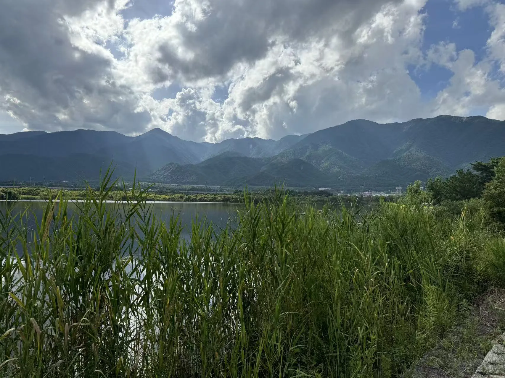</a>
      <figcaption class="gallery-caption"><time datetime="2024-07-27">2024.07.27</time><span aria-hidden="true">·</span><span data-i18n="gallery.place.otsu">Otsu</span></figcaption>
    </figure>
    <figure class="gallery-item gallery-item--wide">
      <a class="gallery-lightbox lightbox" href="assets/gallery/2024-06-08-amanohashidate.webp" data-gallery="photo-gallery">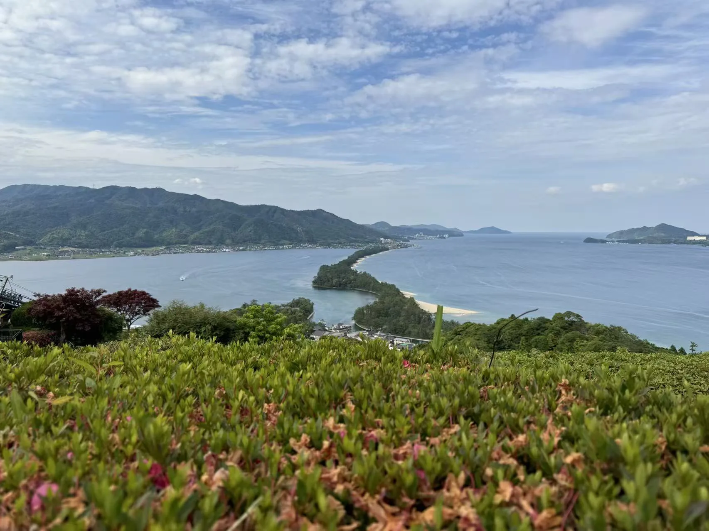</a>
      <figcaption class="gallery-caption"><time datetime="2024-06-08">2024.06.08</time><span aria-hidden="true">·</span><span data-i18n="gallery.place.amanohashidate">Amanohashidate, Miyazu</span></figcaption>
    </figure>
    <figure class="gallery-item gallery-item--five">
      <a class="gallery-lightbox lightbox" href="assets/gallery/2022-11-05-nanzenji.webp" data-gallery="photo-gallery">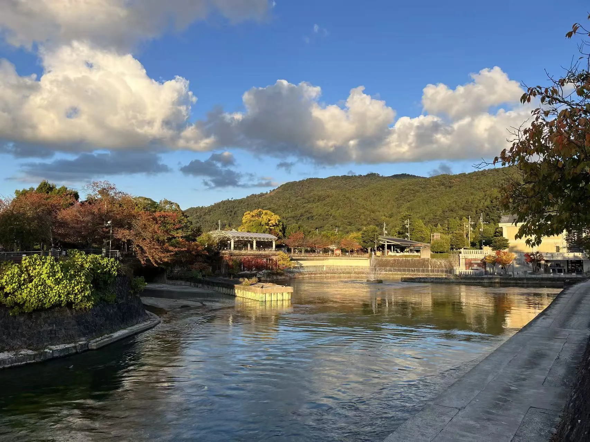</a>
      <figcaption class="gallery-caption"><time datetime="2022-11-05">2022.11.05</time><span aria-hidden="true">·</span><span data-i18n="gallery.place.nanzenji">Nanzen-ji Temple Area</span></figcaption>
    </figure>
    <figure class="gallery-item gallery-item--seven">
      <a class="gallery-lightbox lightbox" href="assets/gallery/2025-11-16-kawachinagano.webp" data-gallery="photo-gallery">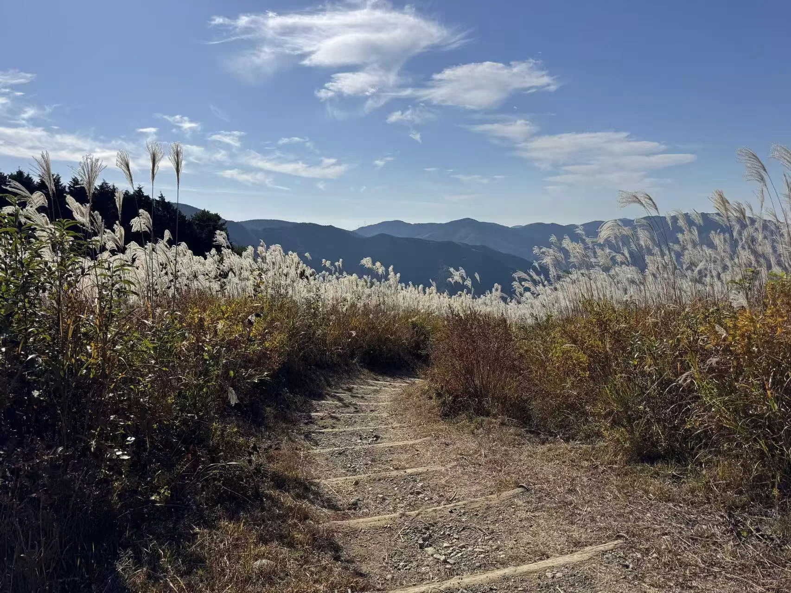</a>
      <figcaption class="gallery-caption"><time datetime="2025-11-16">2025.11.16</time><span aria-hidden="true">·</span><span data-i18n="gallery.place.kawachinagano">Mount Iwawaki</span></figcaption>
    </figure>
    <figure class="gallery-item gallery-item--seven">
      <a class="gallery-lightbox lightbox" href="assets/gallery/2024-10-24-kobe.webp" data-gallery="photo-gallery">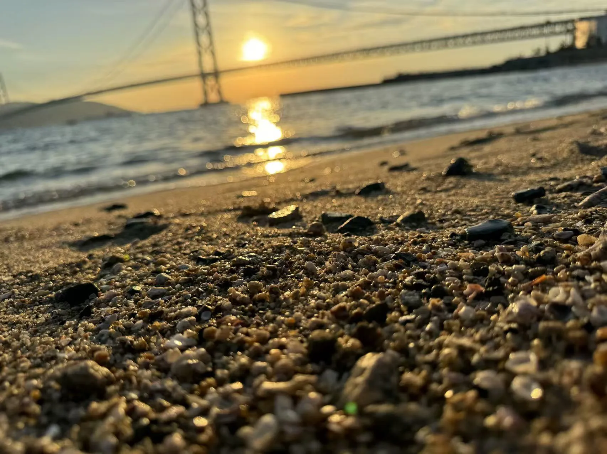</a>
      <figcaption class="gallery-caption"><time datetime="2024-10-24">2024.10.24</time><span aria-hidden="true">·</span><span data-i18n="gallery.place.kobe">Akashi Kaikyo Bridge, Kobe</span></figcaption>
    </figure>
    <figure class="gallery-item gallery-item--five">
      <a class="gallery-lightbox lightbox" href="assets/gallery/2022-10-23-odaigahara.webp" data-gallery="photo-gallery">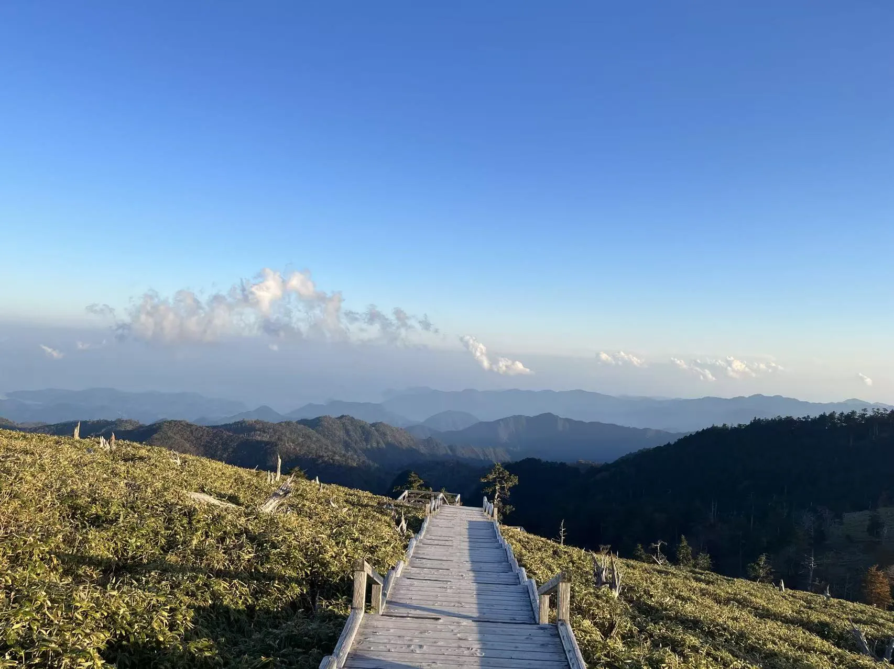</a>
      <figcaption class="gallery-caption"><time datetime="2022-10-23">2022.10.23</time><span aria-hidden="true">·</span><span data-i18n="gallery.place.odaigahara">Odaigahara Plateau</span></figcaption>
    </figure>
    <figure class="gallery-item gallery-item--five">
      <a class="gallery-lightbox lightbox" href="assets/gallery/2022-08-25-hiroshima.webp" data-gallery="photo-gallery">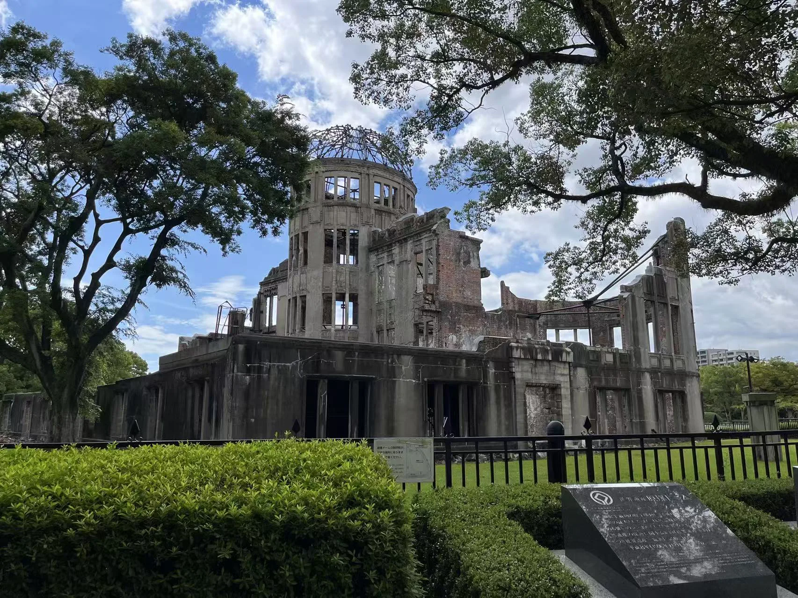</a>
      <figcaption class="gallery-caption"><time datetime="2022-08-25">2022.08.25</time><span aria-hidden="true">·</span><span data-i18n="gallery.place.hiroshima">Atomic Bomb Dome</span></figcaption>
    </figure>
    <figure class="gallery-item gallery-item--seven">
      <a class="gallery-lightbox lightbox" href="assets/gallery/2022-08-23-miyajima.webp" data-gallery="photo-gallery">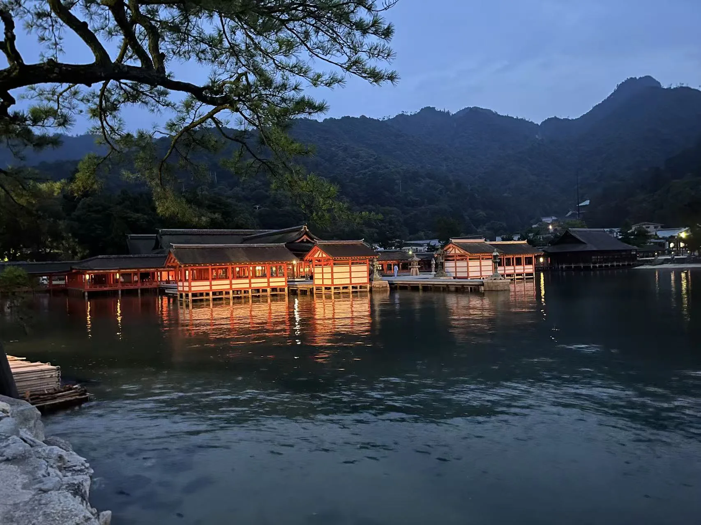</a>
      <figcaption class="gallery-caption"><time datetime="2022-08-23">2022.08.23</time><span aria-hidden="true">·</span><span data-i18n="gallery.place.miyajima">Itsukushima Shrine</span></figcaption>
    </figure>
    <figure class="gallery-item">
      <a class="gallery-lightbox lightbox" href="assets/gallery/2025-08-12-ishigaki-blue-cave.webp" data-gallery="photo-gallery">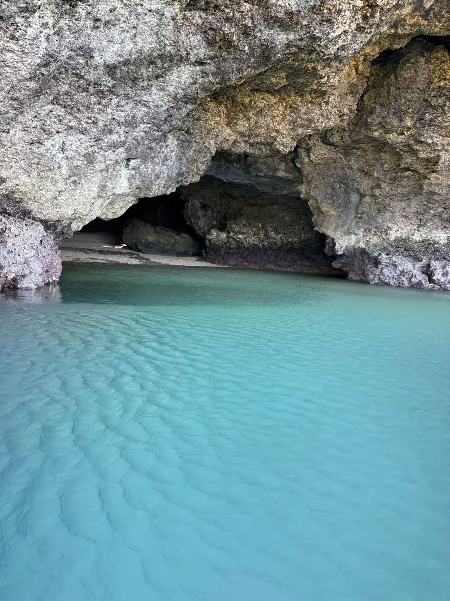</a>
      <figcaption class="gallery-caption"><time datetime="2025-08-12">2025.08.12</time><span aria-hidden="true">·</span><span data-i18n="gallery.place.ishigakiBlueCave">Blue Cave, Ishigaki Island</span></figcaption>
    </figure>
    <figure class="gallery-item">
      <a class="gallery-lightbox lightbox" href="assets/gallery/2025-08-08-ishigaki.webp" data-gallery="photo-gallery">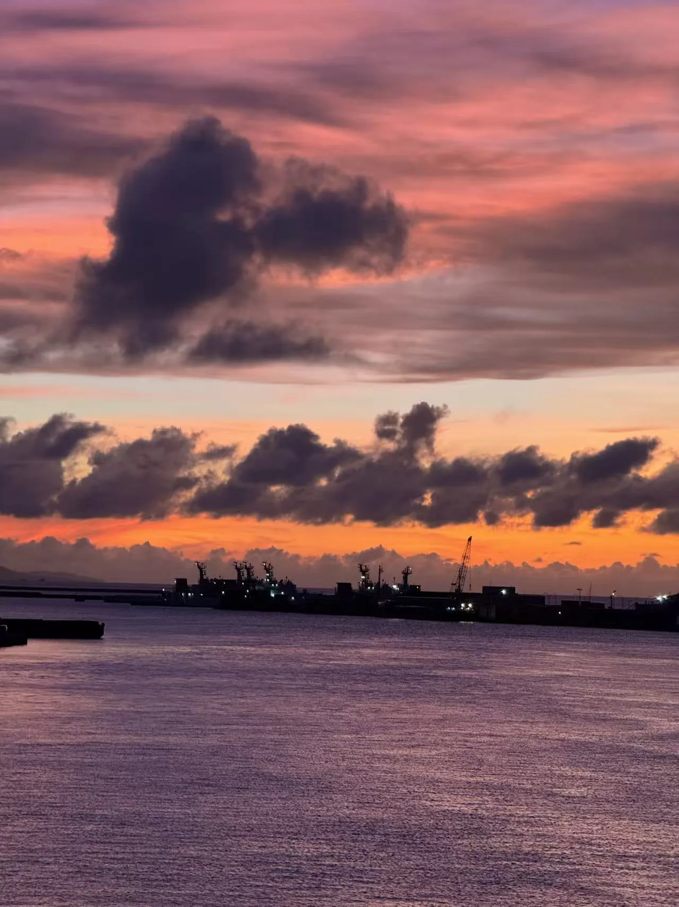</a>
      <figcaption class="gallery-caption"><time datetime="2025-08-08">2025.08.08</time><span aria-hidden="true">·</span><span data-i18n="gallery.place.ishigaki">Ishigaki Island</span></figcaption>
    </figure>

    <!-- Australia -->
    <figure class="gallery-item gallery-item--seven">
      <a class="gallery-lightbox lightbox" href="assets/gallery/2023-07-16-cairns.webp" data-gallery="photo-gallery">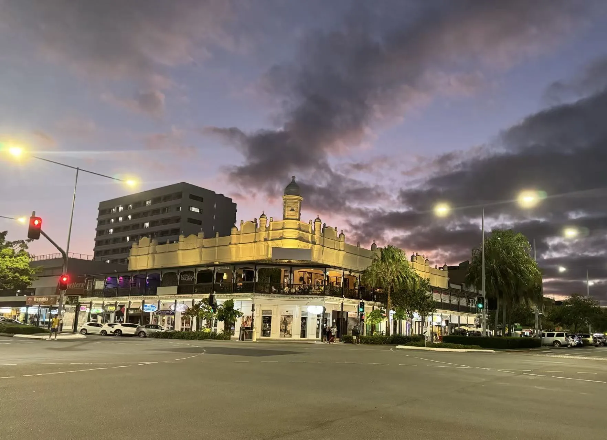</a>
      <figcaption class="gallery-caption"><time datetime="2023-07-16">2023.07.16</time><span aria-hidden="true">·</span><span data-i18n="gallery.place.cairns">Cairns</span></figcaption>
    </figure>
    <figure class="gallery-item gallery-item--five">
      <a class="gallery-lightbox lightbox" href="assets/gallery/2024-07-20-fitzroy-island.webp" data-gallery="photo-gallery">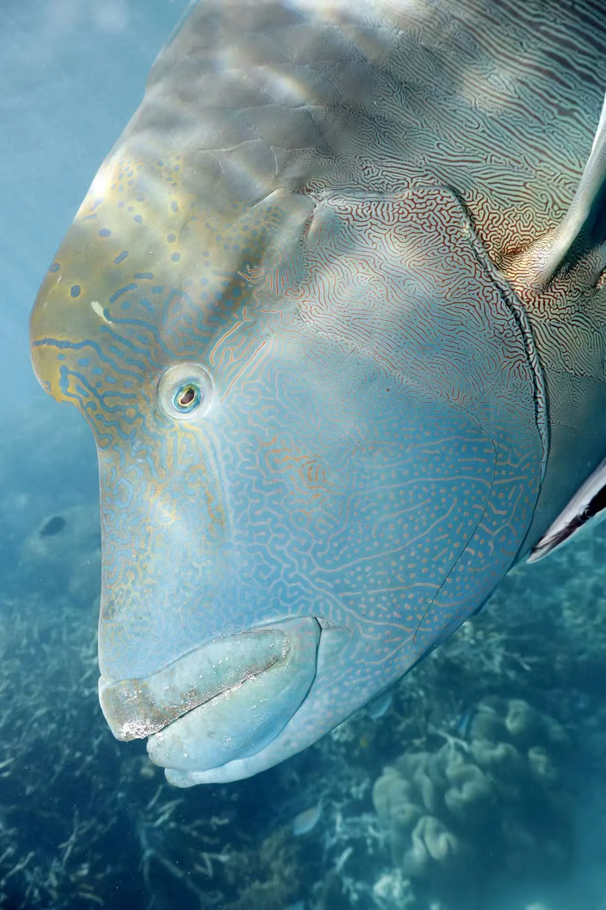</a>
      <figcaption class="gallery-caption"><time datetime="2024-07-20">2024.07.20</time><span aria-hidden="true">·</span><span data-i18n="gallery.place.fitzroy">Fitzroy Island, Great Barrier Reef</span></figcaption>
    </figure>

    <!-- Germany -->
    <figure class="gallery-item gallery-item--five">
      <a class="gallery-lightbox lightbox" href="assets/gallery/2025-12-14-munich.webp" data-gallery="photo-gallery"></a>
      <figcaption class="gallery-caption"><time datetime="2025-12-14">2025.12.14</time><span aria-hidden="true">·</span><span data-i18n="gallery.place.munich">New Town Hall, Munich</span></figcaption>
    </figure>
    <figure class="gallery-item gallery-item--seven">
      <a class="gallery-lightbox lightbox" href="assets/gallery/2025-12-18-kreuth.webp" data-gallery="photo-gallery">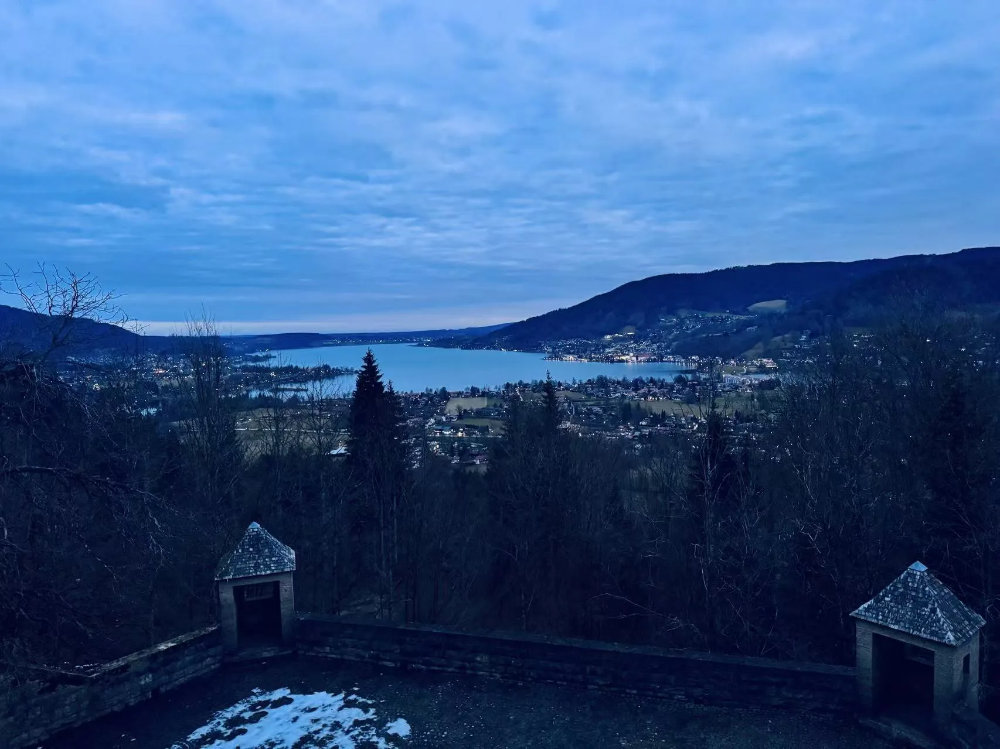</a>
      <figcaption class="gallery-caption"><time datetime="2025-12-18">2025.12.18</time><span aria-hidden="true">·</span><span data-i18n="gallery.place.kreuth">Tagungsstätte Schloss Ringberg, Tegernsee</span></figcaption>
    </figure>
  </div>

  <footer class="gallery-credits" aria-label="Map sources" data-i18n-aria-label="gallery.map.creditsAria">
    <a href="https://www.naturalearthdata.com/" target="_blank" rel="noopener noreferrer">Natural Earth</a><span aria-hidden="true">·</span><a href="https://leafletjs.com/" target="_blank" rel="noopener noreferrer">Leaflet</a>
  </footer>
</div>
```

::: {.gallery-lightbox-loader aria-hidden="true"}
{.lightbox}
:::

```{=html}
<script src="assets/js/gallery-map.js"></script>
```
