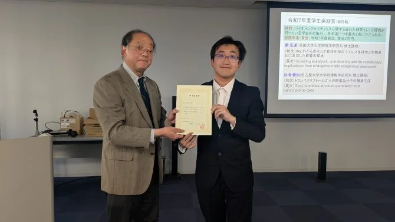

```{=html}
<div class="page-shell highlight-page">
<header class="page-header highlight-header">
<p class="highlight-meta"><span data-i18n="bioJapan.eyebrow">Award record</span><time datetime="2026-03-05">2026.03.05</time></p>
<h1 class="page-title" data-i18n="bioJapan.title" data-document-title>Received the FY2025 Student Encouragement Award from NPO Bioinformatics Japan</h1>
</header>

<figure class="highlight-media">

</figure>

<section class="highlight-docket" aria-labelledby="biojapan-docket-title">
<p class="highlight-docket-label" id="biojapan-docket-title" data-i18n="detail.summary">Record sheet</p>
<dl class="highlight-facts">
<div><dt data-i18n="detail.meta.award">Award</dt><dd data-i18n="bioJapan.award">FY2025 Student Encouragement Award</dd></div>
<div><dt data-i18n="detail.meta.date">Date</dt><dd>2026.03.05</dd></div>
<div><dt data-i18n="detail.meta.organization">Organization</dt><dd data-i18n="bioJapan.organization">NPO Bioinformatics Japan</dd></div>
<div><dt data-i18n="detail.meta.location">Location</dt><dd data-i18n="bioJapan.venue">Room CB207, Kyoto University Uji Campus</dd></div>
<div><dt data-i18n="detail.meta.lecture">Award lecture</dt><dd lang="en">A bioinformatic framework for exploring the eukaryotic viral landscape based on large and giant endogenous viral elements</dd></div>
</dl>
</section>

<section class="content-section">
<h2 class="content-label" data-i18n="detail.record">Record</h2>
<div class="prose-slot highlight-prose">
<p data-i18n="bioJapan.record.copy">On 5 March 2026, I received NPO Bioinformatics Japan’s FY2025 Student Encouragement Award at Kyoto University’s Uji Campus. After the ceremony, I gave a 30-minute award lecture on a bioinformatic framework for identifying large and giant endogenous dsDNA viral elements across eukaryotic genomes.</p>
<p data-i18n="bioJapan.research.copy">The framework supports the detection, taxonomic assignment, and phylogenetic reconstruction of endogenous viral regions, helping expand our view of eukaryote–virus associations and long-term virus–host coevolution.</p>
<nav class="highlight-links" aria-label="Record sources" data-i18n-aria-label="detail.links.aria">
<a href="https://www.bioinformatics.jp/ja/workshop11.html" target="_blank" rel="noopener noreferrer"><span data-i18n="detail.link.program">Official program</span> <span aria-hidden="true">↗</span></a>
</nav>
</div>
</section>

<nav class="highlight-back" aria-label="Back to notes" data-i18n-aria-label="detail.back.aria">
<a href="../../index.html#coverage"><span aria-hidden="true">←</span> <span data-i18n="detail.back">Back to notes</span></a>
</nav>
</div>
```
