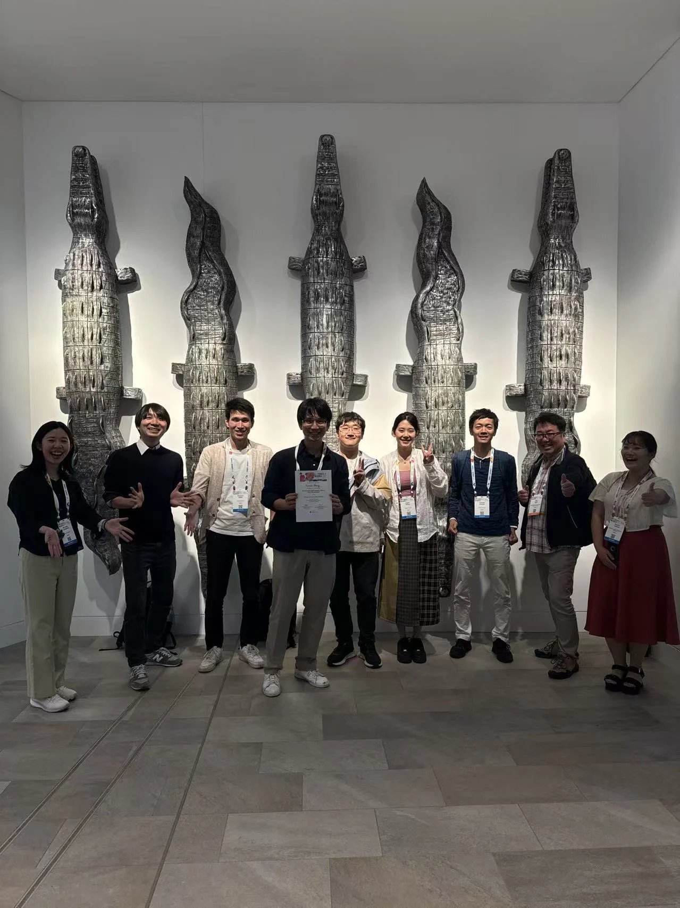

```{=html}
<div class="page-shell highlight-page">
<header class="page-header highlight-header">
<p class="highlight-meta"><span data-i18n="poster.eyebrow">Conference record</span><time datetime="2024-07-18">2024.07.18</time></p>
<h1 class="page-title" data-i18n="poster.title" data-document-title>Poster presentation at Viruses of Microbes 2024</h1>
<p class="page-lead" data-i18n="poster.lead">I presented a poster at Viruses of Microbes 2024 in Cairns, Australia.</p>
</header>

<figure class="highlight-media">

</figure>

<section class="content-section">
<h2 class="content-label" data-i18n="detail.record">Record</h2>
<div class="prose-slot highlight-prose">
<p data-i18n="poster.record.copy">Viruses of Microbes 2024 was held in Cairns from 15 to 19 July 2024. I presented this poster on 18 July.</p>
<p class="highlight-citation">Zhao H., Meng L., Hikida H., Ogata H. “Eukaryotic genomic analysis reveals broad host spectrum of a novel viral group: mirusviruses.”</p>
<nav class="highlight-links" aria-label="Conference links">
<a href="https://www.theasm.org.au/asm-conferences-and-events/2024/7/15/viruses-of-microbes-2024" target="_blank" rel="noopener noreferrer"><span data-i18n="detail.link.event">Conference website</span> ↗</a>
</nav>
</div>
</section>

<nav class="highlight-back" aria-label="Back">
<a href="../../index.html#coverage"><span aria-hidden="true">←</span> <span data-i18n="detail.back">Back to coverage</span></a>
</nav>
</div>
```
