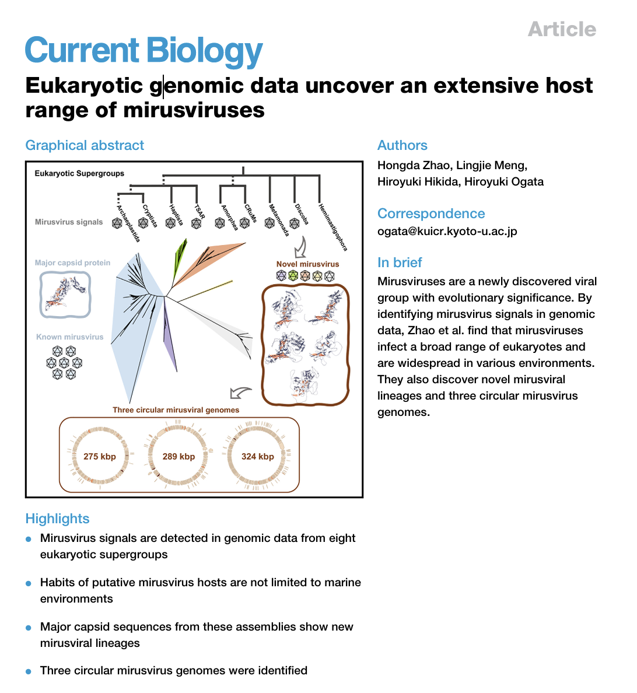

```{=html}
<div class="page-shell highlight-page">
<header class="page-header highlight-header">
<p class="highlight-meta"><span data-i18n="current.eyebrow">Publication record</span><time datetime="2024-04-30">2024.04.30</time></p>
<h1 class="page-title" data-document-title><span data-i18n="current.title.before">First-author paper on mirusviruses accepted for publication in </span><em lang="en">Current Biology</em><span data-i18n="current.title.after"></span></h1>
</header>

<figure class="highlight-media">

</figure>

<section class="content-section">
<h2 class="content-label" data-i18n="detail.record">Record</h2>
<div class="prose-slot highlight-prose">
<p data-i18n="current.record.copy">The manuscript was accepted on 30 April 2024 and published online on 27 May 2024.</p>
<p class="highlight-citation">Zhao H., Meng L., Hikida H., Ogata H. “Eukaryotic genomic data uncover an extensive host range of mirusviruses.” <em lang="en">Current Biology</em> 34(12), 2633–2643.e3 (2024). DOI: 10.1016/j.cub.2024.04.085.</p>
<p data-i18n="current.research.copy">The study examines mirusvirus signals in eukaryotic genomic data and shows that these viruses likely infect a broad range of eukaryotes across diverse environments.</p>
<nav class="highlight-links" aria-label="Record sources" data-i18n-aria-label="detail.links.aria">
<a href="https://www.cell.com/current-biology/fulltext/S0960-9822(24)00598-0" target="_blank" rel="noopener noreferrer"><span data-i18n="detail.link.article">Read the article</span> <span aria-hidden="true">↗</span></a>
<a href="https://doi.org/10.1016/j.cub.2024.04.085" target="_blank" rel="noopener noreferrer">DOI <span aria-hidden="true">↗</span></a>
</nav>
</div>
</section>

<nav class="highlight-back" aria-label="Back to notes" data-i18n-aria-label="detail.back.aria">
<a href="../../index.html#coverage"><span aria-hidden="true">←</span> <span data-i18n="detail.back">Back to notes</span></a>
</nav>
</div>
```
