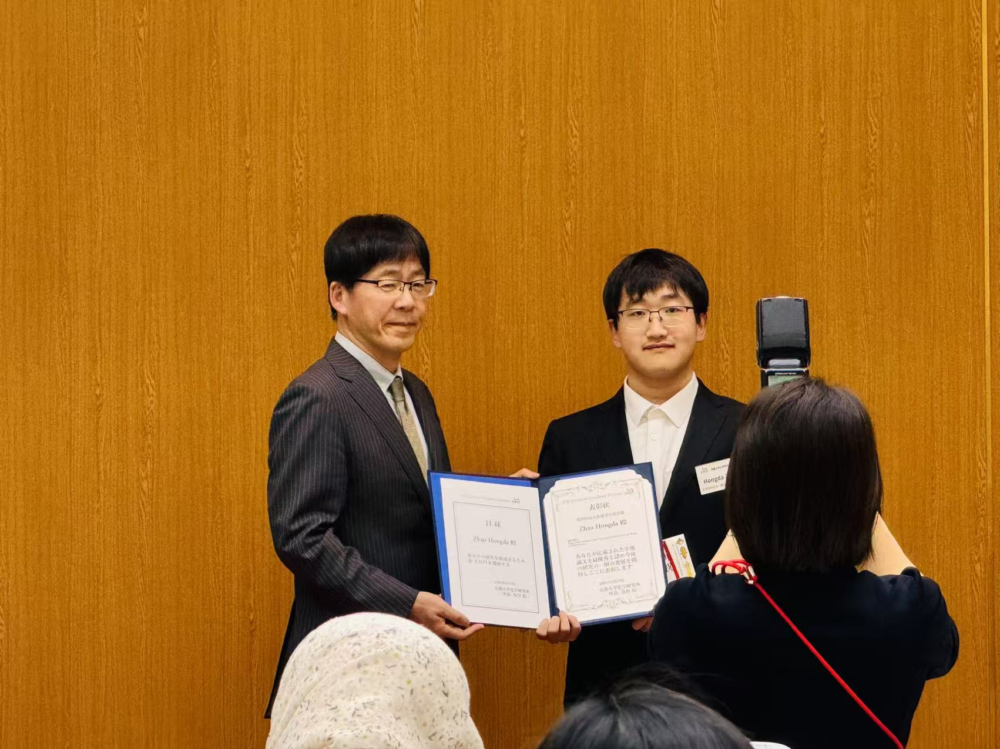
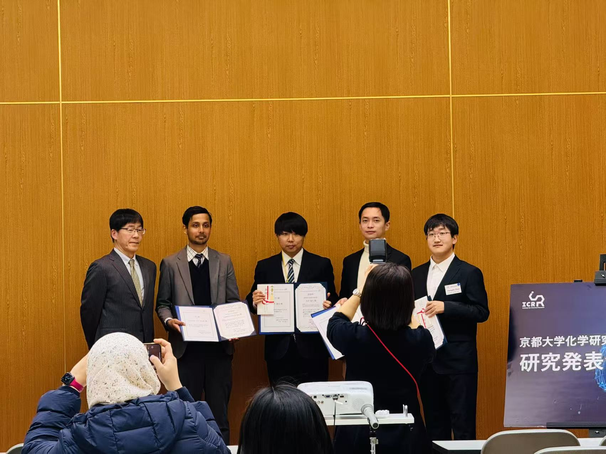

```{=html}
<div class="page-shell highlight-page">
<header class="page-header highlight-header">
<p class="highlight-meta"><span data-i18n="award.eyebrow">Award record</span><time datetime="2025-02-14">2025.02.14</time></p>
<h1 class="page-title" data-i18n="award.title" data-document-title>Received the ICR Award for Graduate Students</h1>
</header>

<figure class="highlight-media highlight-media-grid">


</figure>

<section class="content-section">
<h2 class="content-label" data-i18n="detail.record">Record</h2>
<div class="prose-slot highlight-prose">
<p data-i18n="award.record.copy">The award was presented at the 124th ICR Research Presentation Meeting, where I also gave an award lecture about the research.</p>
<nav class="highlight-links" aria-label="Record sources" data-i18n-aria-label="detail.links.aria">
<a href="https://www.kuicr.kyoto-u.ac.jp/sites/news/news_250214/" target="_blank" rel="noopener noreferrer"><span data-i18n="detail.link.source">Official announcement</span> <span aria-hidden="true">↗</span></a>
</nav>
</div>
</section>

<section class="content-section">
<h2 class="content-label" data-i18n="detail.details">Details</h2>
<div class="prose-slot">
<dl class="highlight-facts">
<div><dt data-i18n="detail.meta.award">Award</dt><dd data-i18n="award.name">ICR Award for Graduate Students</dd></div>
<div><dt data-i18n="detail.meta.date">Date</dt><dd>2025.02.14</dd></div>
<div><dt data-i18n="detail.meta.venue">Venue</dt><dd data-i18n="award.venue">124th ICR Research Presentation Meeting</dd></div>
<div><dt data-i18n="detail.meta.work">Work</dt><dd>Eukaryotic Genomic Data Uncover an Extensive Host Range of Mirusviruses</dd></div>
</dl>
</div>
</section>

<nav class="highlight-back" aria-label="Back to notes" data-i18n-aria-label="detail.back.aria">
<a href="../../index.html#coverage"><span aria-hidden="true">←</span> <span data-i18n="detail.back">Back to notes</span></a>
</nav>
</div>
```
