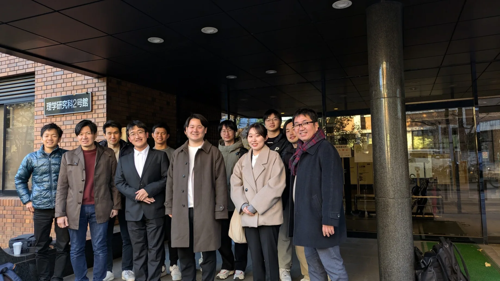

```{=html}
<div class="page-shell highlight-page">
<header class="page-header highlight-header">
<p class="highlight-meta"><span data-i18n="thesisDetail.eyebrow">Academic milestone</span><time datetime="2025-01-28">2025.01.28</time></p>
<h1 class="page-title" data-i18n="thesisDetail.title" data-document-title>Master’s thesis presentation and Q&amp;A</h1>
</header>

<figure class="highlight-media">

</figure>

<section class="highlight-docket" aria-labelledby="thesis-docket-title">
<p class="highlight-docket-label" id="thesis-docket-title" data-i18n="detail.summary">Record sheet</p>
<dl class="highlight-facts">
<div><dt data-i18n="detail.meta.milestone">Milestone</dt><dd data-i18n="thesisDetail.milestone">Master’s thesis presentation and Q&amp;A</dd></div>
<div><dt data-i18n="detail.meta.date">Date</dt><dd>2025.01.28</dd></div>
<div><dt data-i18n="detail.meta.institution">Institution</dt><dd data-i18n="thesisDetail.institution">Kyoto University</dd></div>
<div><dt data-i18n="detail.meta.laboratory">Laboratory</dt><dd data-i18n="thesisDetail.laboratory">Ogata Lab</dd></div>
<div><dt data-i18n="detail.meta.thesis">Thesis</dt><dd lang="en">Discovery of endogenous viral sequences in eukaryotic genomes reveals unrecognized host ranges of giant viruses</dd></div>
</dl>
</section>

<section class="content-section">
<h2 class="content-label" data-i18n="detail.record">Record</h2>
<div class="prose-slot highlight-prose">
<p data-i18n="thesisDetail.record.copy">On 28 January 2025, I presented and discussed my master’s thesis at Kyoto University. The session also included master’s thesis presentations by Saki Kikuya and Komei Nagasaka.</p>
<p data-i18n="thesisDetail.context.copy">The lab lists the thesis under its 2025 master’s theses. Its formal title is retained above in English.</p>
<nav class="highlight-links" aria-label="Record sources" data-i18n-aria-label="detail.links.aria">
<a href="https://cls.kuicr.kyoto-u.ac.jp/%e8%8f%8a%e7%9f%a2-%e5%92%b2%e5%ad%a3%e3%81%95%e3%82%93%e3%80%81%e9%95%b7%e5%9d%82-%e5%ad%94%e6%98%8e%e3%81%95%e3%82%93%e3%80%81%e8%b6%99-%e5%ae%8f%e9%81%94%ef%bc%88%e3%82%b8%e3%83%a3%e3%82%aa/" target="_blank" rel="noopener noreferrer"><span data-i18n="detail.link.labAnnouncement">Ogata Lab announcement</span> <span aria-hidden="true">↗</span></a>
</nav>
</div>
</section>

<nav class="highlight-back" aria-label="Back to notes" data-i18n-aria-label="detail.back.aria">
<a href="../../index.html#coverage"><span aria-hidden="true">←</span> <span data-i18n="detail.back">Back to notes</span></a>
</nav>
</div>
```
