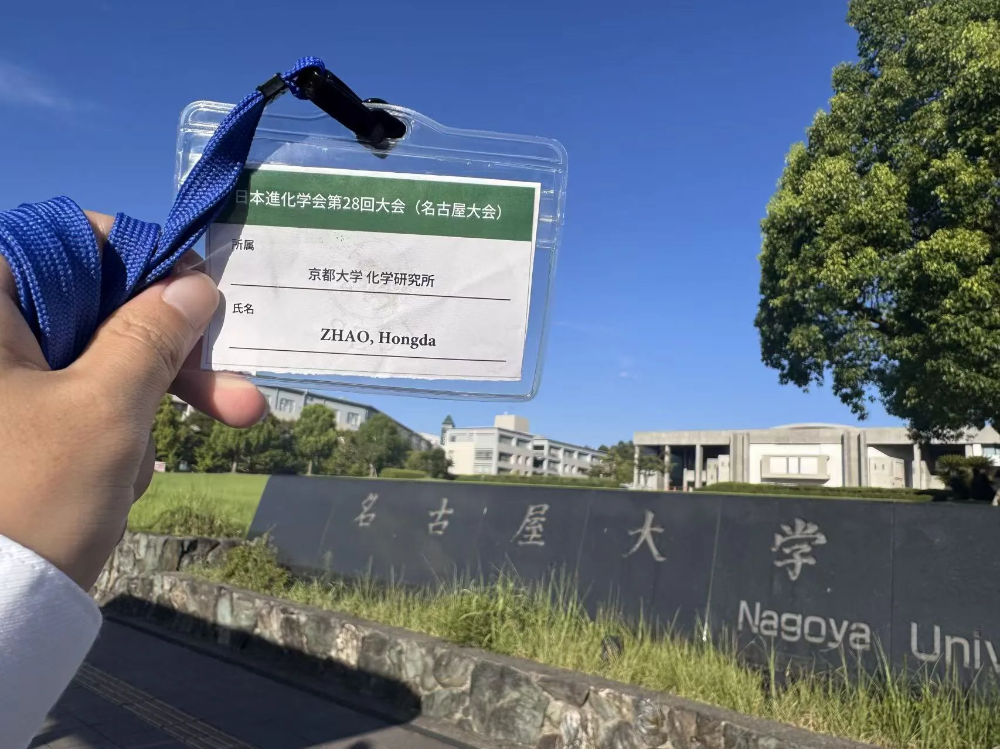
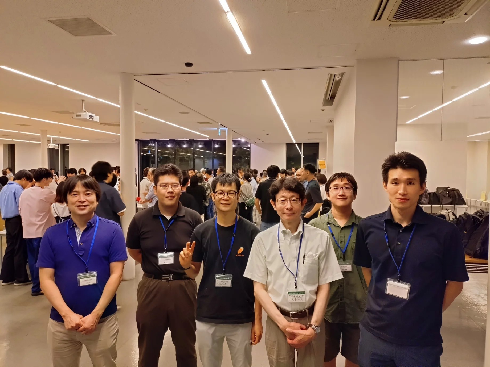

```{=html}
<div class="page-shell highlight-page">
<header class="page-header highlight-header">
<p class="highlight-meta"><span data-i18n="sesj2026.eyebrow">Conference record</span><time datetime="2026-08-19">2026.08.19</time></p>
<h1 class="page-title" data-i18n="sesj2026.title" data-document-title>Oral presentation at the 28th Annual Meeting of the Society for Evolutionary Studies, Japan, in Nagoya</h1>
</header>

<figure class="highlight-media highlight-media-grid">


</figure>

<section class="content-section">
<h2 class="content-label" data-i18n="detail.reflection">Personal note</h2>
<div class="prose-slot highlight-prose">
<p data-i18n="sesj2026.reflection.copy">Something unexpected came up for my professor, so I travelled to Nagoya at short notice to give the presentation in their place. It was my first annual meeting of the Society for Evolutionary Studies, Japan. I met many professors and researchers I had previously exchanged ideas with and heard talks on interesting work in evolutionary biology.</p>
</div>
</section>

<section class="highlight-docket" aria-labelledby="sesj-2026-docket-title">
<p class="highlight-docket-label" id="sesj-2026-docket-title" data-i18n="detail.summary">Record sheet</p>
<dl class="highlight-facts">
<div><dt data-i18n="detail.meta.event">Event</dt><dd data-i18n="sesj2026.event">The 28th Annual Meeting of the Society for Evolutionary Studies, Japan</dd></div>
<div><dt data-i18n="detail.meta.dates">Dates</dt><dd>2026.08.19–22</dd></div>
<div><dt data-i18n="detail.meta.location">Location</dt><dd data-i18n="sesj2026.location">Nagoya University, Higashiyama Campus, Nagoya, Japan</dd></div>
<div><dt data-i18n="detail.meta.format">Format</dt><dd data-i18n="sesj2026.format">Symposium oral presentation · 19 August 2026 · 13:54–14:16 · Room B · S2-4</dd></div>
<div><dt data-i18n="detail.meta.session">Session</dt><dd data-i18n="sesj2026.session">S2 · Dissemination of genetic information by transposons and pangenome evolution</dd></div>
<div><dt data-i18n="detail.meta.talk">Talk</dt><dd lang="en">Eukaryotic genome evolution driven by virus-to-host horizontal gene transfer</dd></div>
</dl>
</section>

<section class="content-section">
<h2 class="content-label" data-i18n="detail.record">Record</h2>
<div class="prose-slot highlight-prose">
<p data-i18n="sesj2026.record.copy">On 19 August 2026, I gave an oral presentation (S2-4) in a symposium at the 28th Annual Meeting of the Society for Evolutionary Studies, Japan, held at Nagoya University.</p>
<p class="highlight-citation">Ogata H., Zhao H., Meng L., Zhang R. “Eukaryotic genome evolution driven by virus-to-host horizontal gene transfer.” Symposium oral presentation S2-4, The 28th Annual Meeting of the Society for Evolutionary Studies, Japan, 19 August 2026.</p>
<nav class="highlight-links" aria-label="Record sources" data-i18n-aria-label="detail.links.aria">
<a href="https://sesj2026.agr.nagoya-u.ac.jp/" target="_blank" rel="noopener noreferrer"><span data-i18n="detail.link.event">Conference website</span> <span aria-hidden="true">↗</span></a>
<a href="https://sesj2026.agr.nagoya-u.ac.jp/%E5%A4%A7%E4%BC%9A%E3%83%97%E3%83%AD%E3%82%B0%E3%83%A9%E3%83%A0%E3%83%BB%E7%99%BA%E8%A1%A8%E6%BC%94%E9%A1%8C%E4%B8%80%E8%A6%A7_v2.pdf" target="_blank" rel="noopener noreferrer"><span data-i18n="detail.link.program">Official program</span> <span aria-hidden="true">↗</span></a>
</nav>
</div>
</section>

<nav class="highlight-back" aria-label="Back to notes" data-i18n-aria-label="detail.back.aria">
<a href="../../index.html#coverage"><span aria-hidden="true">←</span> <span data-i18n="detail.back">Back to notes</span></a>
</nav>
</div>
```
