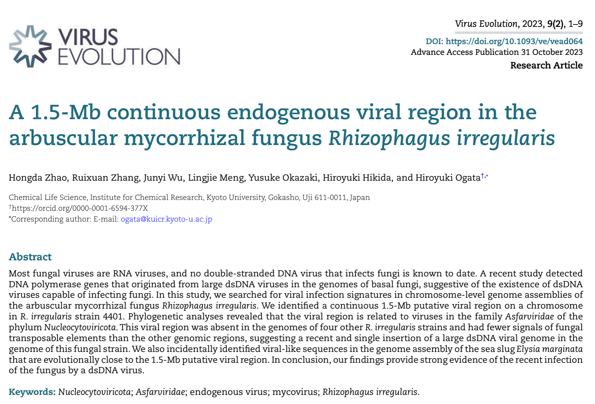

```{=html}
<div class="page-shell highlight-page">
<header class="page-header highlight-header">
<p class="highlight-meta"><span data-i18n="virusEvolution.eyebrow">Publication record</span><time datetime="2023-10-04">2023.10.04</time></p>
<h1 class="page-title" data-document-title><span data-i18n="virusEvolution.title.before">My first paper in </span><em lang="en">Virus Evolution</em><span data-i18n="virusEvolution.title.after"></span></h1>
</header>

<figure class="highlight-media">

</figure>

<section class="highlight-docket" aria-labelledby="virus-evolution-docket-title">
<p class="highlight-docket-label" id="virus-evolution-docket-title" data-i18n="detail.summary">Record sheet</p>
<dl class="highlight-facts">
<div><dt data-i18n="detail.meta.role">Role</dt><dd data-i18n="virusEvolution.role">First author</dd></div>
<div><dt data-i18n="detail.meta.announcement">Lab announcement</dt><dd>2023.10.04</dd></div>
<div><dt data-i18n="detail.meta.accepted">Accepted</dt><dd>2023.10.25</dd></div>
<div><dt data-i18n="detail.meta.published">Published</dt><dd>2023.10.31</dd></div>
<div><dt>DOI</dt><dd>10.1093/ve/vead064</dd></div>
</dl>
</section>

<section class="content-section">
<h2 class="content-label" data-i18n="detail.record">Record</h2>
<div class="prose-slot highlight-prose">
<p data-i18n="virusEvolution.record.copy">On 4 October 2023, Ogata Lab announced my first paper in Virus Evolution. The journal records formal acceptance on 25 October and online publication on 31 October 2023.</p>
<p class="highlight-citation">Zhao H., Zhang R., Wu J., Meng L., Okazaki Y., Hikida H., Ogata H. “A 1.5-Mb continuous endogenous viral region in the arbuscular mycorrhizal fungus <em lang="la">Rhizophagus irregularis</em>.” <em lang="en">Virus Evolution</em> 9(2), vead064 (2023). DOI: 10.1093/ve/vead064.</p>
<p data-i18n="virusEvolution.research.copy">The study identified a continuous 1.5-Mb putative endogenous viral region on chromosome 8 of Rhizophagus irregularis strain 4401. Genomic and phylogenetic evidence links it to Asfarviridae-related large dsDNA viruses and supports a relatively recent viral integration.</p>
<nav class="highlight-links" aria-label="Record sources" data-i18n-aria-label="detail.links.aria">
<a href="https://academic.oup.com/ve/article/9/2/vead064/7334491" target="_blank" rel="noopener noreferrer"><span data-i18n="detail.link.article">Read the article</span> <span aria-hidden="true">↗</span></a>
<a href="https://cls.kuicr.kyoto-u.ac.jp/%e4%bf%ae%e5%a3%ab1%e5%b9%b4%e3%81%aezhao-hongda%e5%90%9b%e3%81%ae%e8%ab%96%e6%96%87%e3%81%8c-virus-evolution-%e3%81%ab%e5%8f%97%e7%90%86%e3%81%95%e3%82%8c%e3%81%be%e3%81%97%e3%81%9f%e3%80%82%e3%81%8a/" target="_blank" rel="noopener noreferrer"><span data-i18n="detail.link.labAnnouncement">Ogata Lab announcement</span> <span aria-hidden="true">↗</span></a>
</nav>
</div>
</section>

<nav class="highlight-back" aria-label="Back to notes" data-i18n-aria-label="detail.back.aria">
<a href="../../index.html#coverage"><span aria-hidden="true">←</span> <span data-i18n="detail.back">Back to notes</span></a>
</nav>
</div>
```
