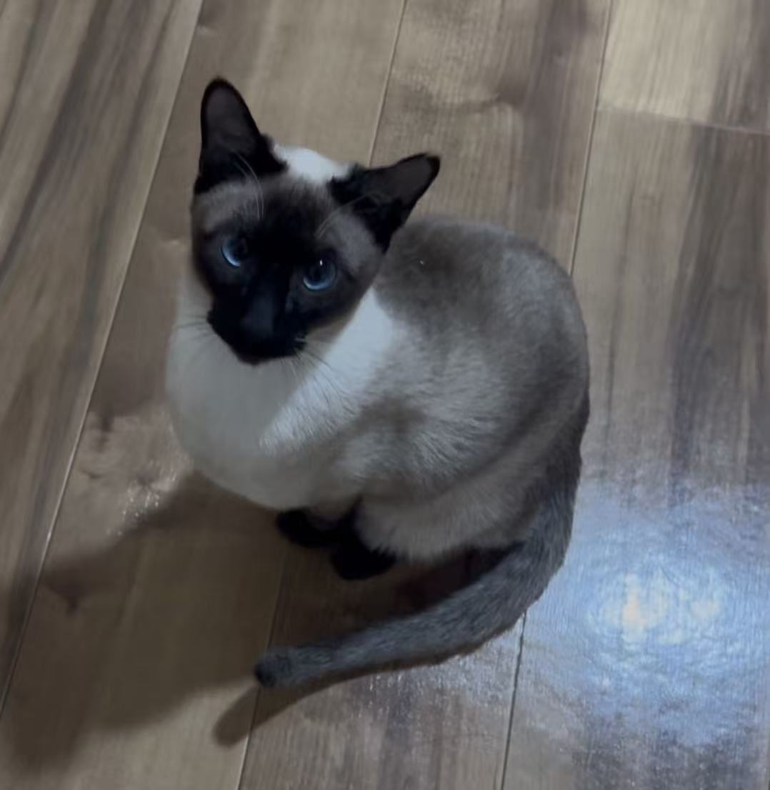

```{=html}
<div class="blog-profile" role="complementary" aria-label="About the author">

<div>
<strong>Hongda Zhao</strong>
<span>Bioinformatics · Computational genomics · AI for science</span>
<p>Research notes, technical work, and field observations.</p>
<nav aria-label="Author links">
<a href="./about.html">About</a>
<a href="./research.html">Research</a>
</nav>
</div>
</div>

<section class="blog-intro">
<p class="blog-kicker">A personal notebook</p>
<p class="blog-title" role="heading" aria-level="1">Notes on life, technology &amp; research.</p>
</section>

<section class="latest-heading">
<div>
<p class="blog-kicker">Latest writing</p>
<h2>Recent notes</h2>
</div>
<a href="./notes.html">All posts</a>
</section>

<div class="blog-empty-guidance">
<p>No notes have been published yet.</p>
<span>New posts will appear here automatically. Start from <code>posts/template/index.qmd</code>.</span>
</div>

<section class="external-links" aria-labelledby="external-links-title">
<header class="external-links-heading">
<div>
<p class="blog-kicker">Elsewhere</p>
<h2 id="external-links-title">Lab announcements</h2>
</div>
<span>Ogata Lab · Kyoto University</span>
</header>
<div class="external-links-list">
<a class="external-link-item" href="https://cls.kuicr.kyoto-u.ac.jp/%e7%89%b9%e5%ae%9a%e9%9d%9e%e5%96%b6%e5%88%a9%e6%b4%bb%e5%8b%95%e6%b3%95%e4%ba%ba%e3%83%90%e3%82%a4%e3%82%aa%e3%82%a4%e3%83%b3%e3%83%95%e3%82%a9%e3%83%9e%e3%83%86%e3%82%a3%e3%82%af%e3%82%b9%e3%83%bb/" target="_blank" rel="noopener noreferrer">
<time datetime="2026-03-05">2026.03.05</time>
<span>特定非営利活動法人バイオインフォマティクス・ジャパン令和7年度学生奨励賞をZhao Hongdaさんが受賞しました</span>
<b aria-hidden="true">↗</b>
</a>
<a class="external-link-item" href="https://cls.kuicr.kyoto-u.ac.jp/%e5%8f%97%e8%b3%9e%e3%81%8c%e6%b1%ba%e5%ae%9a%e3%81%97%e3%81%be%e3%81%97%e3%81%9f%e3%80%82/" target="_blank" rel="noopener noreferrer">
<time datetime="2025-11-28">2025.11.28</time>
<span>受賞が決定しました。</span>
<b aria-hidden="true">↗</b>
</a>
<a class="external-link-item" href="https://cls.kuicr.kyoto-u.ac.jp/%e8%8f%8a%e7%9f%a2-%e5%92%b2%e5%ad%a3%e3%81%95%e3%82%93%e3%80%81%e9%95%b7%e5%9d%82-%e5%ad%94%e6%98%8e%e3%81%95%e3%82%93%e3%80%81%e8%b6%99-%e5%ae%8f%e9%81%94%ef%bc%88%e3%82%b8%e3%83%a3%e3%82%aa/" target="_blank" rel="noopener noreferrer">
<time datetime="2025-01-28">2025.01.28</time>
<span>菊矢 咲季さん、長坂 孔明さん、趙 宏達（ジャオ ホンダ）さんが修士論文の発表を行いました。</span>
<b aria-hidden="true">↗</b>
</a>
<a class="external-link-item" href="https://cls.kuicr.kyoto-u.ac.jp/%e4%bf%ae%e5%a3%ab1%e5%b9%b4%e3%81%aezhao-hongda%e5%90%9b%e3%81%ae%e8%ab%96%e6%96%87%e3%81%8c-virus-evolution-%e3%81%ab%e5%8f%97%e7%90%86%e3%81%95%e3%82%8c%e3%81%be%e3%81%97%e3%81%9f%e3%80%82%e3%81%8a/" target="_blank" rel="noopener noreferrer">
<time datetime="2023-10-04">2023.10.04</time>
<span>修士1年のZhao Hongda君の論文が Virus Evolution に受理されました。</span>
<b aria-hidden="true">↗</b>
</a>
</div>
</section>
```
