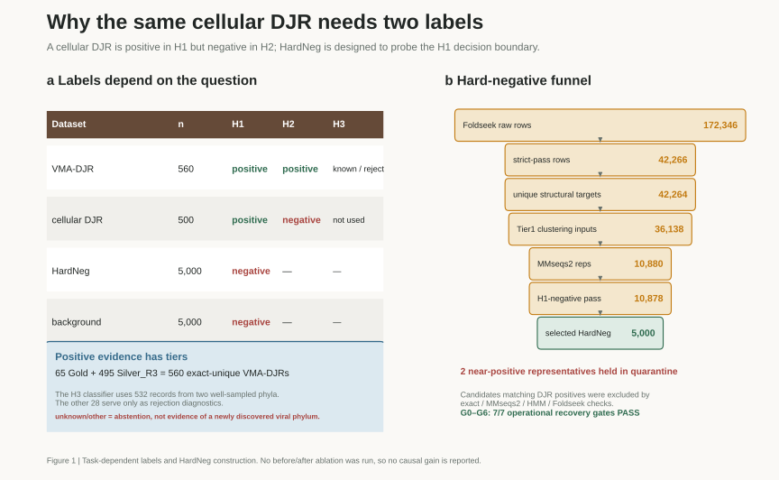
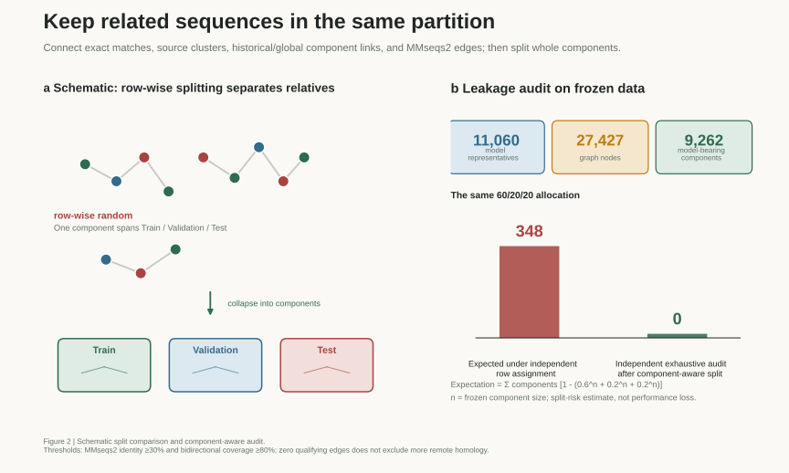
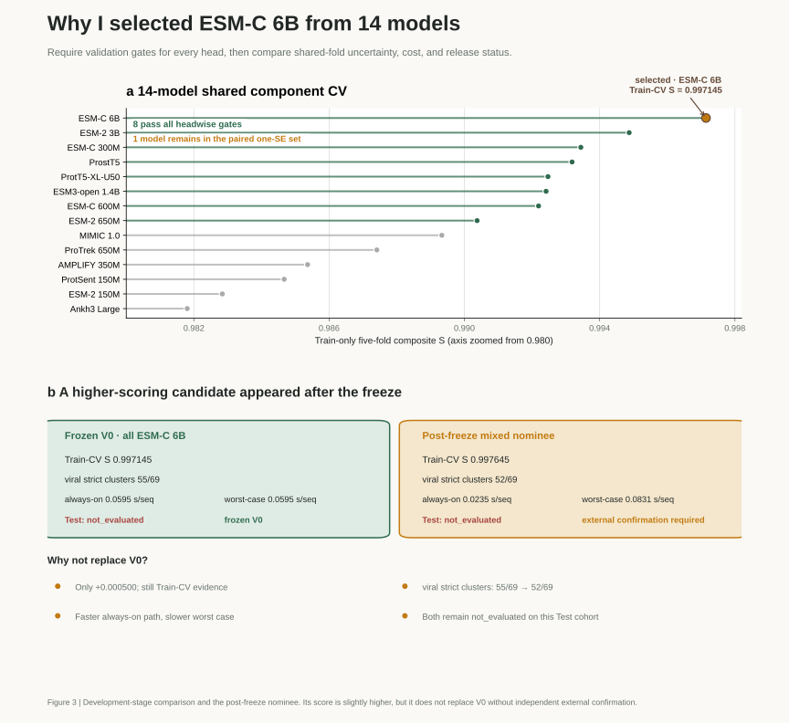

<nav class="article-language-switch" aria-label="Article language">English·<a href="../djr-mcp-finder-evidence-first-ai4s/" hreflang="zh-CN" lang="zh-CN" data-language-target="zh">中文</a></nav>

On 30 July 2026, I released [DJR-MCP Finder v0.1](https://github.com/Hongda-Zhao/DJR-MCP-Finder/releases/tag/v0.1) on GitHub. This was the project's first formal release. Here, v0.1 is the software release number, while the released model is called Model V0. The mixed nominee discussed later remains an experimental candidate.

[DJR-MCP Finder](https://github.com/Hongda-Zhao/DJR-MCP-Finder) is a protein classifier for viral evolution research. It accepts protein FASTA sequences and searches for candidate major capsid proteins that may adopt the double-jelly-roll (DJR) fold and be associated with viral morphogenesis. The project was developed in the context of DJR-MCP lineages within *Varidnaviria*; it does not claim that every member of the realm uses a DJR-MCP.

This article is not a user guide. It is a development retrospective: why I built the tool, which decisions proved most difficult, and how working with Codex changed the way I developed it.

## Why Look for DJR-MCPs?

Major capsid proteins (MCPs) are central components of the capsids built by many viruses, predominantly double-stranded DNA viruses in this context. In viruses whose MCPs adopt the DJR fold, these proteins also provide important clues for studying viral morphogenesis, genome annotation, and deep evolutionary relationships.

The difficulty is that [sequence similarity among distantly related DJR-MCPs can be very low](https://pmc.ncbi.nlm.nih.gov/articles/PMC8812541/). A search based only on existing annotations or high sequence similarity can therefore miss distantly related candidates.

The problem cannot simply be reframed as “find every DJR protein,” either. Cellular organisms also encode DJR proteins, so a DJR fold does not by itself establish that a protein is a viral MCP.

DJR-MCP Finder is not intended to make a final identification on the user's behalf. Its goal is to:

> Reduce a large protein collection to a manageable candidate list with explicit evidence limits, so that structure, genomic context, and virological evidence can be examined next.

I therefore divided the problem into three tasks:

1. **H1:** determine whether a protein has a DJR fold;
2. **H2:** among DJR proteins, determine whether it is associated with viral morphogenesis;
3. **H3:** attempt to assign it to one of two known viral phyla with enough labeled examples.

When the evidence for H3 is insufficient, the tool returns `unknown/other`. This is an abstention from a forced assignment, not evidence for a newly discovered viral phylum.

## The Hardest Part Was Defining the Labels

One of the first problems I encountered was that the same cellular DJR protein had to be a positive example in H1 and a negative example in H2.

This is not a labeling conflict.

H1 asks whether the protein has a DJR fold. H2 starts from that premise and asks whether it is associated with viral morphogenesis. If both questions are compressed into a flat multiclass table, the biological role of cellular DJRs is lost.

The three tasks therefore use different label definitions:

* H1 uses 560 virus-morphogenesis-associated DJRs (VMA-DJRs) and 500 cellular DJRs as positive examples, and 5,000 HardNeg records plus 5,000 background proteins as negative examples;
* H2 considers only DJR proteins and distinguishes VMA-DJRs from cellular DJRs;
* the H3 classifier is fitted on *Nucleocytoviricota* and *Preplasmiviricota*, while the remaining records are used only to examine rejection behavior.

The positive set was not copied directly from a single database table. After reviewing the literature and structural evidence and deduplicating the sequences, I retained 560 VMA-DJR representatives.

Some were higher-confidence Gold examples. The rest were Silver_R3 examples selected using fixed structural references and consistent thresholds. Silver_R3 is the data rule used in this release, not an immutable ground truth.

## Hard Negatives: Easy Negatives Are Not Enough

If every H1 negative were an ordinary protein with little resemblance to DJR proteins, the model could easily obtain an impressive score. But such a score might reflect protein length, composition, or database source rather than the structural boundary I actually cared about.

I therefore built a separate set of structurally similar hard negatives.

The process began with 172,346 Foldseek search records. After quality filtering, deduplication, and MMseqs2 clustering, I used sequence, HMM, and structure checks to exclude candidates that still matched the DJR positives. I then selected 5,000 HardNeg representatives.

Two representatives were too close to the positive set. Rather than forcing them into the negative class, I placed them in quarantine and excluded them from training.

This set has a specific purpose: to probe whether the model mistakes proteins that resemble DJRs for positive examples after sequence, HMM, and structure checks have supported their exclusion from the H1-positive set.

I did not run a directly comparable before-and-after ablation, so I do not attribute a numerical performance gain to the hard-negative set. What I can verify is that rerunning the workflow from the frozen inputs reproduces the same representatives and final outputs, and that the exclusion rules and G0–G6 recovery gates are auditable. The project does not claim that every raw intermediate file was retained or reproduced byte for byte.

<figure class="article-figure">

<figcaption>Figure 1 | How labels change across the three tasks, and how the HardNeg set was constructed. On mobile, scroll horizontally or open the full SVG.</figcaption>
</figure>

## Split by Component, Not by Sequence

Two protein records may be non-identical yet still belong to the same family or originate from the same upstream cluster.

If each row is assigned independently to training, validation, and test partitions, the test set may contain close relatives of training examples. The resulting score can look excellent while overstating generalization.

To reduce this form of leakage, I first built a relation graph that connected records sharing any of the following:

* an identical normalized sequence;
* the same source cluster;
* a known historical or global component relationship;
* an MMseqs2 relationship with at least 30% identity and at least 80% coverage in both directions.

Each connected component in this graph became a relation component. I assigned entire components—not individual sequences—to a partition.

The 11,060 modeling records formed 9,262 components containing at least one modeling record. Using the frozen component sizes, a row-wise random 60/20/20 split would be expected to split about 348 components across two or more partitions.

After the component-aware split, an independent workflow searched all three pairs of partitions. It found no exact duplicate sequences, no overlapping components, and no residual relationships that met the prespecified identity and coverage thresholds.

This does not prove that no pairs of remote homologs below 30% identity remain across partitions. It does, however, let me state precisely which relationships were isolated, which thresholds were used, and how the result can be checked.

<figure class="article-figure">

<figcaption>Figure 2 | Row-wise splitting compared with relation-component splitting. The value 348 is a theoretical expectation, not a measured decrease in model performance.</figcaption>
</figure>

## Model Selection Cannot Stop at the Top Score

I compared 14 protein representation models using one fixed five-fold component assignment within the training partition.

Each model first had to pass a prespecified validation criterion for every task. The remaining models were then compared with a paired one-standard-error comparison across the same folds. Eight models passed every validation gate, but only ESM-C 6B remained in the one-standard-error set. I therefore froze it as Model V0.

These development scores come from Train-CV, not from the test set.

This stage also exposed a particularly instructive error.

For one ESM-2 650M run, sigmoid-transformed scores had saturated to exact zeros and ones, producing an average precision (AP) of about 0.857. Recomputing AP from the corresponding raw decision scores, which retained ranking information, gave about 0.998 for the same run.

The model had not suddenly improved. The input to the metric had changed.

That experience made it clear that a metric contract—the precise definition of a score and the input it consumes—is part of model selection, not an implementation detail to inspect only after the results are produced.

<figure class="article-figure">

<figcaption>Figure 3 | Development-stage comparison of 14 protein representations and the mixed nominee identified after the freeze. The x-axis in panel a begins at 0.980 and is intentionally magnified.</figcaption>
</figure>

## A Slightly Higher Score Is Not Enough to Replace a Frozen Model

After Model V0 had been frozen, I obtained a mixed-model candidate—the mixed nominee—with a slightly higher composite score.

Its Train-CV score was about 0.0005 higher than that of V0, but it performed worse in the viral strict-cluster diagnostic—an internal post-freeze check—and had a slower worst-case inference path. I therefore recorded it as `recommended_for_external_confirmation` rather than overturning the frozen choice because of a very small score difference.

The important question here is not which model ranks first. It is whether the release rules remain robust to repeated experimentation during development.

## `not_evaluated` Can Be a Meaningful Result

The project retains a protected test set containing 2,214 records.

This test set had already been opened for an earlier ESM-2 650M model. The subsequently selected ESM-C 6B model and the mixed nominee were not evaluated on it, so their model-level evaluation status remains `not_evaluated`.

I chose not to reopen the old test set. The next genuinely independent evaluation will require a new external lockbox separated from the existing source components.

I once might have regarded a results table without a complete set of test metrics as unfinished. I now prefer to preserve `not_evaluated`, because it says clearly that the test set was not used to chase a more attractive result for these models.

## What Codex Helped Me Accelerate

In the past, I usually used AI to solve isolated coding problems. In this project, I worked with Codex continuously in the same repository for the first time.

I used Codex to:

* draft and revise scripts;
* run tests and organize logs;
* compare intermediate results;
* expand literature-search terms;
* inspect citations, data leakage, and metric implementations;
* turn complex steps into review checklists.

Every iteration, however, still began with the scientific question and constraints that I defined.

Literature suggestions, labeling proposals, and methodological options returned by the agent were inputs for review, not conclusions. I went back to the original papers, figures, and database records to judge whether each record met the Gold or Silver criteria and whether it should be included. After a rule was implemented, I continued to review diffs, logs, frozen files, and key artifacts, then revised and reran the analysis when I found a problem.

The greatest benefit of Codex was not that it decided what the correct answer should be. It allowed me to advance literature search, implementation, testing, and review in parallel, and to find inconsistencies between those parts sooner.

Based on my development records and recollection, the path from the initial design to the first completed benchmark took about two months. Without this form of collaboration, it would probably have taken longer. I remained responsible for defining the dataset boundaries, judging the biological evidence, and standing behind the final conclusions.

## Summary

### 1. An AI4S Project Starts with the Right Problem Decomposition

A DJR fold is useful structural evidence, but it is not equivalent to viral identity. The existence of cellular DJRs forced me to separate H1 from H2. It also reinforced that model output must still be interpreted alongside structure, genomic context, and virological evidence.

### 2. Data and Labels Often Matter More Than the Model

In retrospect, much of the work went into collecting examples, validating Silver positives, constructing negative sets, and selecting representative sequences.

Protein language models can provide powerful representations. But if the positive and negative classes are poorly defined, or if close relatives of training records leak into the test set, even a high score is difficult to interpret.

### 3. In This Project, Protein Language Models Did Not Replace Traditional Homology Search

This benchmark did not give me evidence that protein language models dramatically outperform conventional sequence alignment or profile-HMM methods for homolog detection. The 14-model benchmark compared different protein-language-model representations; it was not a strict head-to-head comparison with MMseqs2 or HMM-based search. This is therefore a methodological judgment from the development process, not a quantitative claim about relative performance.

Traditional methods still provide interpretable alignments, explicit thresholds, and traceable hit relationships. I see protein language models as a complement: they can help rank candidates when sequence similarity is weak and the classification boundary is complex. In practice, I would rather use the two approaches to cross-check each other than ask one to replace the other.

### 4. Preserving the Limits of the Evidence Matters More Than Filling Every Cell

Ambiguous examples can be held in quarantine. A classifier can return `unknown/other` when the evidence is insufficient. A model without an independent evaluation can remain `not_evaluated`.

These states are less visually satisfying than a complete results table, but they describe more honestly how far the evidence currently reaches.
