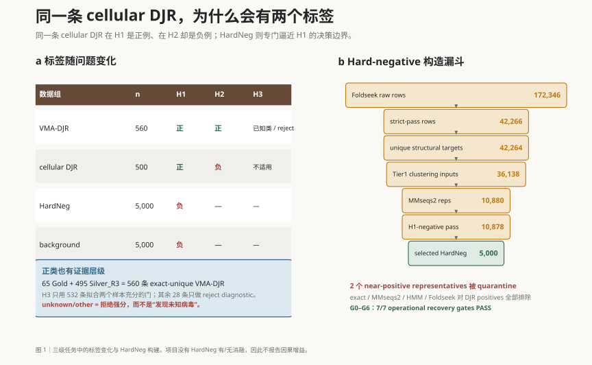
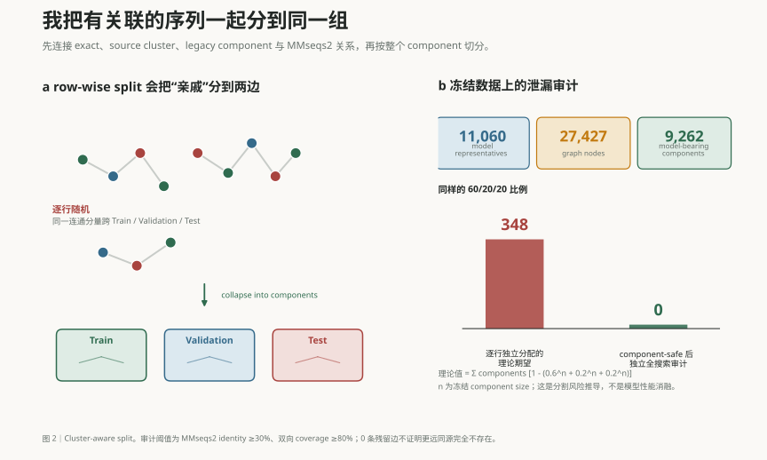
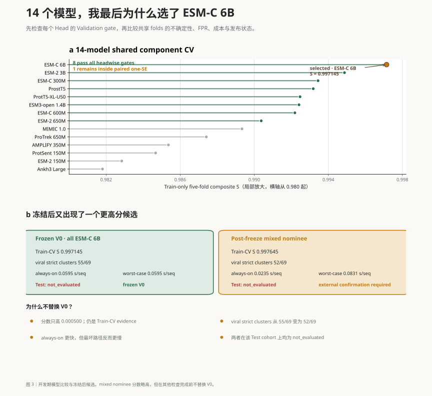

2026 年 7 月 30 日，我在 GitHub 发布了 [DJR-MCP Finder v0.1](https://github.com/Hongda-Zhao/DJR-MCP-Finder/releases/tag/v0.1)，这是项目的首个正式版本。v0.1 是软件的 Release 版本号，随软件发布的模型叫 Model V0；后文提到的 mixed nominee 仍是实验候选。

[DJR-MCP Finder](https://github.com/Hongda-Zhao/DJR-MCP-Finder) 是一个面向病毒演化研究的蛋白质分类工具。它接收蛋白质 FASTA 序列，寻找可能具有 double-jelly-roll（DJR）折叠、并参与 Varidnaviria 病毒形态发生的主要衣壳蛋白候选。

这里记录我开发这个工具的原因、遇到的难题，以及和 Codex 一起工作的经历。

## 为什么要寻找 DJR-MCP

主要衣壳蛋白，也就是 major capsid protein（MCP），是许多双链 DNA 病毒构建衣壳的核心蛋白。对于使用 DJR 折叠 MCP 的病毒来说，这类蛋白也是研究病毒形态发生、基因组注释和深层演化关系的重要线索。

困难在于，远缘 DJR-MCP 之间的[序列相似性可能已经很低](https://pmc.ncbi.nlm.nih.gov/articles/PMC8812541/)。只依赖已有注释或高序列相似性，容易漏掉远缘候选。

细胞生物中也存在 DJR 蛋白，所以仅凭这种折叠，还无法判断一个蛋白是不是病毒 MCP。

DJR-MCP Finder 用来做候选筛选，最终鉴定仍需用户完成：

> 从大量蛋白中筛出一份规模可控、证据边界清楚的候选清单，供后续结构、基因组邻域和病毒学分析继续判断。

我把任务分成三级：

1. **H1：**判断蛋白是否具有 DJR 折叠；
2. **H2：**在 DJR 蛋白中，判断它是否与病毒形态发生相关；
3. **H3：**尝试归入两个样本较充分的已知病毒门。

H3 证据不足时，工具输出 `unknown/other`。这只表示模型拒绝强行分类，并不代表发现了新的病毒门。

## HardNeg：不能只选择容易区分的负样本

如果 H1 的负样本全是与 DJR 差异很大的普通蛋白，模型可能靠蛋白长度、组成或数据库来源就得到很高的分数。这样的评估还不足以判断它能否区分相近的结构，所以我另外构建了一组结构近邻负样本。

候选最初来自 172,346 条 Foldseek 检索记录。经过质量过滤、去重、MMseqs2 聚类，以及序列、HMM 和结构层面对 DJR 正样本的排除后，最终选出了 5,000 条 HardNeg。

有两个 representative 与正样本过于接近，我将它们放进 quarantine，暂时不参与训练。

这组样本用于检查：经过多层排除证据支持为 H1 负例的蛋白，是否仍会因为与 DJR 相近而被模型误判为正例。

我没有做完全可比的“加入 HardNeg 前后”消融，因此不会声称它让性能提高了多少。能够确认的是，冻结输入可以重放出相同的代表与最终输出，排除规则和 G0–G6 recovery gates 也都可以审计；项目并不声称所有原始中间文件都被保留或逐字节一致。

<figure class="article-figure">

<figcaption>图 1｜三级任务中的标签变化，以及 HardNeg 的构建过程。移动端可横向滚动；点击图片可查看完整 SVG。</figcaption>
</figure>

## 数据切分的单位不应该是一条序列

蛋白质数据中的两条记录即使不完全相同，也可能属于同一家族，或者来自同一个上游 cluster。

如果把每一行独立随机分到 Train、Validation 和 Test，模型可能在 Test 中遇到训练样本的近亲。最终分数看起来很好，实际上却高估了泛化能力。

为减少这种泄漏，我先建立了一张关系图，把以下关系连接起来：

* 完全相同的标准化序列；
* 相同的 source cluster；
* 已知的历史或全局 component 关系；
* MMseqs2 identity 不低于 30%，且双向 coverage 不低于 80% 的序列关系。

关系图中的每个连通分量称为一个 relation component。切分时，整个 component 一起分配到同一个数据集。

11,060 条建模记录最终形成了 9,262 个含建模样本的 components。按照冻结后的 component 大小估算，如果仍然逐行随机进行 60/20/20 切分，预计约有 348 个 components 会跨越多个数据集。

采用 component-aware split 后，我又使用独立流程检查了三对 split。完全重复序列、component 重叠，以及达到既定 identity 和 coverage 门槛的残留关系均为 0。

这些检查说明了哪些关系已被隔离，保留的标准和流程也便于复查。不过，30% identity 以下仍可能存在跨数据集的远同源关系。

<figure class="article-figure">

<figcaption>图 2｜逐行切分与 relation-component 切分的区别。右侧的 348 是理论期望，不是模型性能下降值。</figcaption>
</figure>

## 模型选择不能只看排行榜第一名

我使用同一份冻结的 Train-only 五折 component map，比较了 14 种蛋白表征模型。

模型首先需要通过每个 Head 的 Validation gate，再在相同 folds 上进行 paired one-standard-error 比较。最终有 8 个模型通过全部 gates，但只有 ESM-C 6B 进入 one-SE 集合，因此它被冻结为 Model V0。

这里的开发期分数来自 Train-CV，不是 Test 成绩。

这一阶段，我发现 ESM-2 650M 的一批 sigmoid probabilities 饱和成了精确的 0 和 1，计算得到的 AP 只有约 0.857。改用保留排序信息的 raw decision scores 后，同一批预测的 AP 变成约 0.998。分数的变化来自指标输入，模型本身没有改变。

这次错误让我在选择模型时就检查 metric contract，确认指标接收什么输入、怎样计算，避免等结果出来后才回头核对。

<figure class="article-figure">

<figcaption>图 3｜14 种蛋白表征的开发期比较，以及冻结后出现的 mixed nominee。上图横轴从 0.980 起，是局部放大。</figcaption>
</figure>

## 分数稍高，不代表应该替换冻结模型

V0 冻结以后，我又得到一个综合分略高的 mixed nominee。

它的 Train-CV 分数比 V0 高约 0.0005，但在 viral strict cluster 诊断中表现更差，最慢推理路径也更耗时。因此，我将它记录为 `recommended_for_external_confirmation`，而没有因为一个很小的分数差异重新改写已经冻结的选择。

继续实验时，我仍按已有的发布规则处理新候选，没有仅凭这次排名变动重新选择模型。

## `not_evaluated` 也可以是一种有意义的结果

项目保留了一批包含 2,214 条记录的 protected Test。

这批 Test 曾经为较早的 ESM-2 650M 版本打开过。后来选出的 ESM-C 6B 和 mixed nominee 都没有再次访问它，因此它们的模型级状态是 `not_evaluated`。

我决定不重新打开旧 Test。下一次真正独立的评估，需要建立一批与现有 source components 分离的 external lockbox。

以前看到结果表里缺少 Test 指标，我可能会想把它补齐。这次我保留了 `not_evaluated`，明确记录这些模型尚未接受这项评估，也没有为了补分数重新使用旧 Test。

## Codex 帮我加快了什么

过去我使用 AI，通常只是解决一个局部代码问题。这个项目中，我第一次让 Codex 围绕同一个仓库持续参与工作。

它帮助我：

* 起草和修改脚本；
* 运行测试并整理日志；
* 比较中间结果；
* 扩展文献检索词；
* 检查引用、数据泄漏和指标实现；
* 为复杂步骤生成检查清单。

每一轮开始时，我先定义科学问题和限制条件。

Agent 返回的文献、标签建议和方法选项，我都要再核对。判断 Gold、Silver 和样本是否纳入时，我会回到论文原文、图表和数据库记录。规则写进代码后，再检查 diff、日志、冻结文件和关键产物，发现问题就修改和重算。

Codex 让我能够同时推进检索、实现、测试和复查，更快发现不同环节之间的矛盾。哪些结果可信，仍需要我判断。

按我的开发记录和回忆，从最初设计到完成第一版 benchmark，大约用了两个月。没有这种协作，开发周期可能会更长。数据边界、生物学证据和最终结论仍由我负责。

## 一些思考

### 1. AI4S 项目首先需要把科学问题拆对

DJR 是有用的结构证据，但它不等于病毒身份。cellular DJR 的存在迫使我把 H1 和 H2 分开，也提醒我，模型输出之后仍然需要结构、基因组邻域和病毒学证据继续判断。

### 2. 数据和标签通常比模型更重要

这个项目很大一部分时间花在样本收集、Silver positive 验证、负样本构建和代表序列选择上。

蛋白语言模型的表征很有用，但分数能否解释，取决于正负样本是否定义清楚，以及 Test 中有没有混入训练样本的近亲。

### 3. 蛋白语言模型没有取代传统同源搜索

这次 benchmark 没有提供足够证据，证明蛋白语言模型在同源物识别上远超传统序列比对或 profile HMM。这里的 14 模型 benchmark 比较了不同蛋白语言模型表征，没有与 MMseqs2 或 HMM 做严格的正面对照。因此，我对两类方法的看法来自开发经验，还不能据此给出性能倍数。

传统方法仍能提供可解释的匹配、明确的阈值和可追溯的命中关系。序列相似性较弱、分类边界复杂时，蛋白语言模型可以帮助排序候选。在实际工作中，我会用两类方法互相校验。

### 4. 保留边界，比填满结果表更重要

整理结果时，我保留了几种未定状态：不确定的样本进入 quarantine，证据不足的分类输出 `unknown/other`，没有独立评估的模型保留 `not_evaluated`。结果表因此留有空缺，但读者可以看清哪些判断还缺证据。
