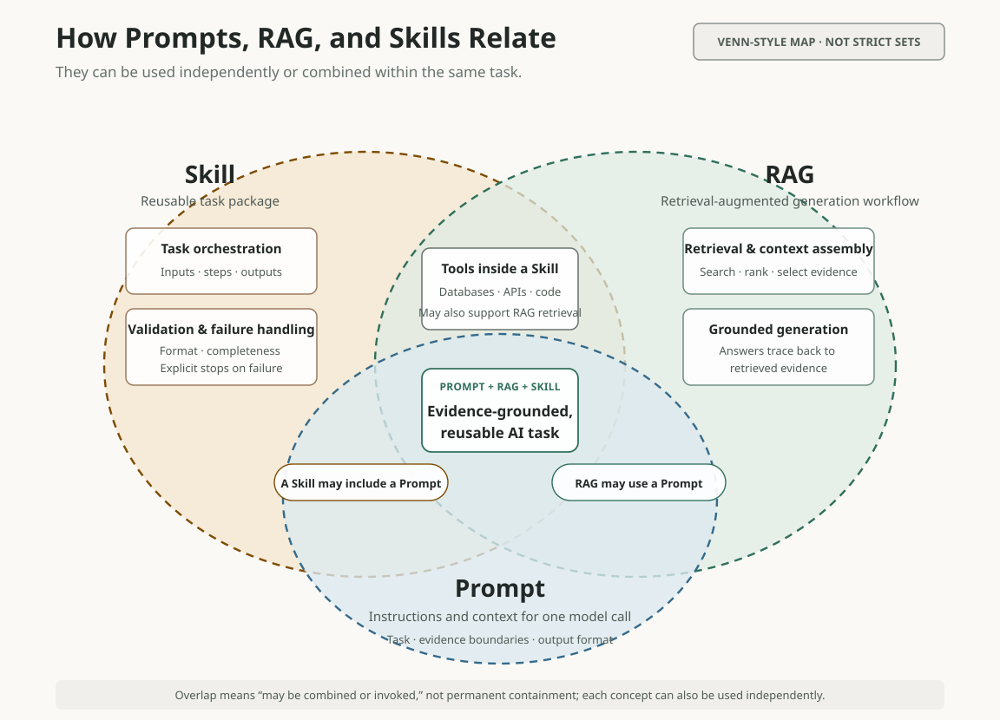

<style>
#quarto-document-content #title-block-header {
  padding-bottom: clamp(2.2rem, 5vw, 3.5rem);
}
#quarto-document-content #title-block-header .quarto-title .title {
  display: block !important;
  max-width: 52rem;
  font-size: clamp(1.35rem, 3vw, 2.15rem);
}
#quarto-document-content #title-block-header .quarto-title-meta {
  display: none;
}
body.fixed-language-content .quarto-secondary-nav-title {
  display: none;
}
#quarto-document-content .article-figure { margin: 1.6rem 0; }
#quarto-document-content .figure-scroll {
  max-width: 100%;
  overflow-x: auto;
  overscroll-behavior-inline: contain;
  -webkit-overflow-scrolling: touch;
}
#quarto-document-content .figure-zoom { display: block; }
#quarto-document-content .figure-zoom img {
  display: block;
  width: 100%;
  height: auto;
}
#quarto-document-content .article-figure figcaption {
  margin-top: 0.6rem;
  color: #66706c;
  font-size: 0.9rem;
  line-height: 1.5;
}
@media (max-width: 767.98px) {
  #quarto-document-content .figure-scroll img {
    width: 900px;
    max-width: none;
  }
  #quarto-document-content table {
    display: block;
    width: 100%;
    max-width: 100%;
    overflow-x: auto;
    -webkit-overflow-scrolling: touch;
  }
}
</style>

While working on EndoViHo-RAG, I kept encountering three terms: Prompt, RAG, and Skill. They are often discussed together, but once I began designing an actual AI system, I realized that they solve three different problems.

All three can be described loosely as ways to help a large language model complete a task. The distinction that has been most useful to me is the question each one answers:

- **Prompt:** What should the model do in this call, what may it rely on, and how should it express the answer?
- **RAG:** Where should the system retrieve question-relevant external evidence before answering?
- **Skill:** How should the instructions, tools, and checks for a class of tasks be organized into a reusable workflow?

This is not a rigid industry taxonomy. Skill, in particular, means somewhat different things on different platforms. But I have found this distinction practical when thinking about scientific AI systems.

<figure class="article-figure">
<div class="figure-scroll">
<a class="figure-zoom" href="figures/figure-1-prompt-rag-skill-en.svg" target="_blank" rel="noopener" aria-label="Open the full SVG for Figure 1 in a new tab"></a>
</div>
<figcaption>Figure 1 | The working distinction I use in this article. A Prompt guides one call, RAG determines how external evidence enters the generation context, and a Skill makes a class of tasks reusable. This is not a universal industry standard.</figcaption>
</figure>

## Prompt: instructions for this model call

A Prompt is the task description and context supplied to a model for a particular call. When people say that they are “writing a Prompt,” they usually mean writing this set of instructions.

For example, a Prompt for a research-data question might say:

```text
Use only the records supplied by the system.
For each result, list its name, identifier, and supporting source.
If retrieval returns no records, write “No records were found in the current dataset.”
Do not rewrite that result as “The item does not exist.”
```

This Prompt defines the task, the evidence boundary, the output fields, and even the wording for an empty result. A Prompt can do more than control tone: it can constrain scope, request a format, and tell the model how to handle uncertainty.

Its boundary is equally important. A Prompt can carry data that has already been supplied to the model, but adding the words “query accurately” does not give the model access to a database.

Likewise, “do not guess” is an important instruction, but it is not a technical guarantee. Permissions, schema constraints, numerical checks, and fail-closed behavior still have to be enforced by software.

I therefore think of a Prompt as the **working instructions for one model call**, not as a source of knowledge.

## RAG: retrieve evidence before the model answers

RAG stands for [Retrieval-Augmented Generation](https://arxiv.org/abs/2005.11401). Its defining idea is not a particular kind of database. It is a system pattern: retrieve external material relevant to the question, put that material into the model’s context, and then generate an answer grounded in what was retrieved.

At its simplest, the flow looks like this:

```text
User question
   ↓
Retrieve records, literature, or other sources
   ↓
Select and organize relevant evidence
   ↓
Place that evidence in the model context
   ↓
Generate an answer with explicit evidence boundaries
```

Retrieval does not have to mean a vector database. Depending on the task, a RAG system might use SQL, full-text search, a knowledge graph, a curated document collection, web pages, APIs, laboratory data, or a combination of these.

Connecting a database is not automatically the same thing as building RAG. If a system runs SQL and returns a table directly, it is performing a database query. It becomes retrieval-augmented generation when the retrieved records are assembled into context and used to ground a subsequent natural-language response.

A well-designed RAG system also separates retrieval from generation. Stable identifiers, numerical values, and source metadata should remain under programmatic control. The model should organize and explain retrieved evidence rather than invent missing facts.

RAG is not “fact insurance.” Retrieval can miss relevant material, rank the wrong material, or surface a flawed source. Its value is that a reader can trace an answer back to particular records and passages and inspect them again.

## Skill: make a class of tasks reusable

Skill is not an academic method with one established definition in the way that RAG is. Different agent platforms place different things inside a Skill and execute them in different ways.

In this article, I use Skill to mean a **reusable task package** in an AI-agent toolchain. Depending on the task, a Skill may package:

- one or more Prompts;
- database queries, API calls, SQL, Python programs, or other tools;
- retrieval, context assembly, and generation steps used by RAG;
- controlled vocabularies, reference material, and input/output schemas;
- validation rules, completeness checks, and failure handling.

A Skill may include all of these elements, or only the ones a task needs. Its defining feature is not complexity, but repeatability: tools execute concrete actions such as querying a database, calling an API, or running code, while the Skill defines when to invoke them, how to pass results between steps, how to validate the output, and what to do when a step fails.

For example, a research-data Skill might normalize domain terms, call database, API, or literature-retrieval tools, run code to deduplicate and summarize the results, validate identifiers and numerical values, and format the final response. If a critical step fails, the workflow should stop explicitly instead of asking the model to fill the gap from general knowledge.

A Skill does not have to use RAG or even a large language model. A simple task may need only a Prompt, while a data-processing task may use only code and validation rules. RAG becomes one part of the Skill only when the task requires external evidence.

## How the three can work together

Prompts, RAG, and Skills operate at different levels. It is more useful to think of them as capabilities that can be combined according to the task than as competing alternatives.

A Prompt can guide one model call on its own or appear inside RAG or a Skill. RAG can operate as a retrieval-and-generation system or become one stage in a Skill. A Skill can organize Prompts, RAG, databases, APIs, executable tools, and validation rules into one process, but it does not have to include all of them.

Rather than treating the three as a fixed containment tree, the Venn-style map below shows some of their possible combinations:

<figure class="article-figure">
<div class="figure-scroll">
<a class="figure-zoom" href="figures/figure-2-prompt-rag-skill-relationship-en.svg" target="_blank" rel="noopener" aria-label="Open the full SVG for Figure 2 in a new tab"></a>
</div>
<figcaption>Figure 2 | A relationship map for Prompts, RAG, and Skills. A Skill can package Prompts, tools, and validation into a reusable task; RAG can call tools for retrieval and use a Prompt to guide evidence-grounded generation. The overlaps show possible combinations, not fixed containment.</figcaption>
</figure>

When all three are used together, a common division of responsibility is for the Skill to orchestrate the task, call tools, and handle failures; for RAG to retrieve and organize external evidence; and for the Prompt to tell the model how to use that evidence in the current response. Database queries, programmatic processing, and result validation remain the responsibility of the relevant tools.

## One question, three responsibilities

Suppose a system has access to versioned data and a document collection, and a user asks:

> Which records in the current dataset match condition X, and what evidence supports each result?

The question sounds like a request for a table, but the system still has to define the retrieval scope, field meanings, and evidence limits.

For this question, the **Prompt** would define the answer rules, for example:

- answer only from records returned by the system;
- report the record name, identifier, relevant value, and supporting source;
- preserve the dataset and literature versions;
- never interpret “no record” as “biologically absent.”

**Retrieval / RAG** would provide the evidence needed for the answer. It could:

- retrieve structured records from a versioned database;
- retrieve supporting passages from the relevant documents;
- assemble the records, sources, and their applicable scope into context for the model.

A **Skill** could package the Prompts, Retrieval / RAG steps, database or API calls, executable code, validation rules, and failure handling into one reusable sequence:

```text
Interpret the question
→ Normalize domain terms
→ Choose a structured, literature, or hybrid retrieval route
→ Call database, API, or retrieval tools
→ Process, deduplicate, and summarize the records
→ Validate numbers, identifiers, versions, and sources
→ Produce the table
→ Explain the result and its limitations
```

The point is the separation of responsibilities: retrieval supplies evidence, the Prompt constrains one model call, and the Skill governs the repeatable workflow and its failure behavior. Every value and interpretation should remain traceable to a release, a record, and a source; the system should also distinguish a genuine empty result from a failed retrieval.

## How I distinguish them now

| Concept | System layer | Main question it answers | What it cannot guarantee on its own |
|---|---|---|---|
| Prompt | One model interaction | What should be done in this call, what may be used, and how should the answer be formatted? | Access to external facts, or enforcement of a written instruction as a hard constraint |
| RAG | Knowledge-access and generation architecture | Where does the evidence come from, and how does it enter the model context? | Complete retrieval, reliable sources, or a factually correct answer |
| Skill | Reusable task workflow | How can Prompts, RAG, tools, and validation rules be organized to carry out a class of tasks consistently? | A correct conclusion merely because the workflow ran, or the same definition across platforms |

If I only need the model to answer in a consistent way, I start with a Prompt. If the answer depends on external, frequently updated, or auditable evidence, I design retrieval or RAG. If the task recurs and requires several of these pieces—Prompts, databases or APIs, code, retrieval, validation, or defined failure handling—I package the larger process as a Skill.
