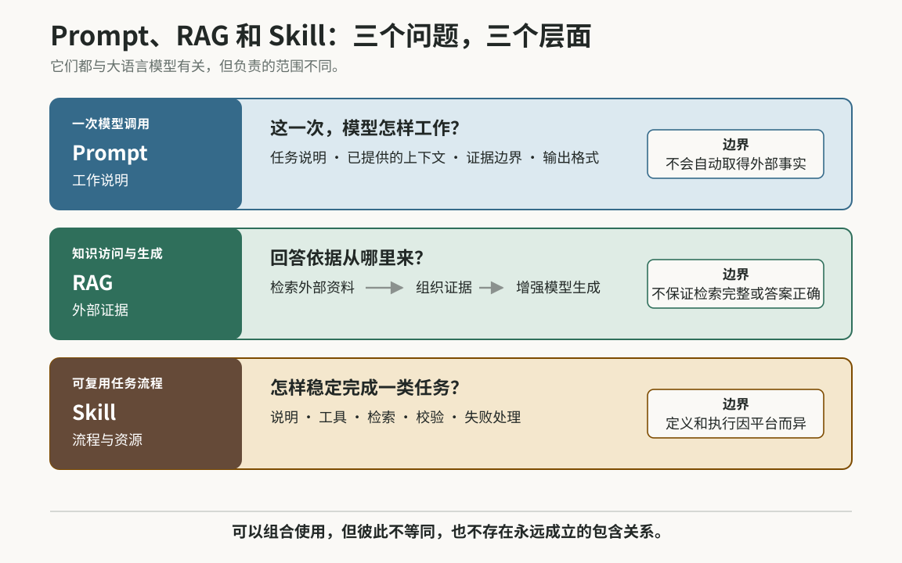
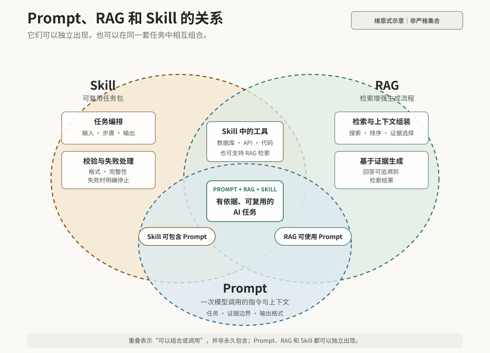

<style>
#quarto-document-content #title-block-header {
  padding-bottom: clamp(2.2rem, 5vw, 3.5rem);
}
#quarto-document-content #title-block-header .quarto-title .title {
  display: block !important;
  max-width: 52rem;
  font-size: clamp(1.35rem, 3vw, 2.15rem);
}
#quarto-document-content #title-block-header .quarto-title-meta {
  display: none;
}
body.fixed-language-content .quarto-secondary-nav-title {
  display: none;
}
#quarto-document-content .article-figure { margin: 1.6rem 0; }
#quarto-document-content .figure-scroll {
  max-width: 100%;
  overflow-x: auto;
  overscroll-behavior-inline: contain;
  -webkit-overflow-scrolling: touch;
}
#quarto-document-content .figure-zoom { display: block; }
#quarto-document-content .figure-zoom img {
  display: block;
  width: 100%;
  height: auto;
}
#quarto-document-content .article-figure figcaption {
  margin-top: 0.6rem;
  color: #66706c;
  font-size: 0.9rem;
  line-height: 1.5;
}
@media (max-width: 767.98px) {
  #quarto-document-content .figure-scroll img {
    width: 900px;
    max-width: none;
  }
  #quarto-document-content table {
    display: block;
    width: 100%;
    max-width: 100%;
    overflow-x: auto;
    -webkit-overflow-scrolling: touch;
  }
}
</style>

最近在搭建 EndoViHo-RAG、学习设计 AI 工具时，我反复遇到三个词：Prompt、RAG 和 Skill。它们经常被放在一起讨论，但真正开始搭系统后，我才发现，这三者解决的其实不是同一个问题。

这三个词听起来都像是在描述“怎样让大语言模型完成任务”，也很容易被混在一起。对我来说，最有用的区分是看它们分别回答什么问题：

- **Prompt：**这一次，要模型做什么、依据什么、怎样表达；
- **RAG：**回答之前，到哪里取得与问题相关的外部证据；
- **Skill：**怎样把一类任务所需的说明、工具和检查步骤组织成可重复使用的流程。

这不是一套严格的行业分类。尤其是 Skill，不同平台对它的定义并不完全相同。不过，对我正在做的科研工具来说，这个区分很实用。

<figure class="article-figure">
<div class="figure-scroll">
<a class="figure-zoom" href="figures/figure-1-prompt-rag-skill.svg" target="_blank" rel="noopener" aria-label="在新标签页打开图 1 的完整 SVG"></a>
</div>
<figcaption>图 1｜本文采用的工作区分。Prompt 管一次调用，RAG 管外部证据怎样进入生成上下文，Skill 管一类任务怎样被稳定复用；这不是统一的行业分层标准。</figcaption>
</figure>

## Prompt：规定这一次模型要怎样工作

Prompt 是模型在一次调用中收到的任务说明和上下文。平时我们说“写 Prompt”，通常是指写给模型的那部分指令。

例如，在一个需要查询研究数据的任务中，可以这样写：

```text
只根据系统提供的记录回答问题。
列出对象名称、记录编号和支持证据。
如果没有检索到记录，请写“当前数据集中没有记录”，不要写成“生物学上不存在”。
```

这段 Prompt 同时规定了任务、证据边界、输出字段和措辞。它不只是控制语气，也可以限制回答范围、指定格式，并告诉模型遇到不确定情况时应怎样处理。

但 Prompt 有一个很清楚的边界：它可以携带已经提供给模型的数据，却不会因为写了“请准确查询”就自动获得数据库访问能力。

同样，“不要猜测”是一条重要指令，但不是可靠的技术保证。数据权限、字段校验、数字核对和出错时停止，仍然需要程序来完成。

所以，我现在更愿意把 Prompt 理解为本次模型调用的**工作说明**，而不是知识来源。

## RAG：先取得证据，再让模型回答

RAG 是 [Retrieval-Augmented Generation](https://arxiv.org/abs/2005.11401)，通常译作“检索增强生成”。它的核心不是某一种数据库，而是一种系统工作方式：在模型生成答案之前，先取回与问题有关的外部资料，再把这些资料放进生成上下文。

最基本的流程是：

```text
用户问题
   ↓
检索数据库、文献或其他资料
   ↓
选择并组织相关证据
   ↓
把证据交给大语言模型
   ↓
生成带有证据边界的回答
```

这里的检索不一定依赖向量数据库。它可以来自 SQL、全文检索、知识图谱、网页、API、实验室内部数据，也可以把几种方式组合起来。具体系统只需要选择与任务相符、能够被验证的资料来源。

需要注意的是，“接入数据库”并不自动等于 RAG。如果系统执行 SQL 后直接返回一张表，那是数据库查询；当取回的记录被组织成上下文，并用于增强后续的自然语言生成时，才符合 RAG 的核心含义。

在科研场景中，可以把版本化的结构化记录作为事实层，把文献作为解释和证据来源。记录编号、计数和数据版本不应该由模型补写；模型的工作是根据取回的内容整理和解释结果，并清楚标出证据边界。

RAG 也不是“事实保险”。检索可能漏掉资料、选错资料，来源本身也可能有问题。它真正带来的价值，是让回答可以回到具体记录和文献重新检查。

## Skill：把一类任务变成可重复调用的流程

Skill 不是像 RAG 那样有相对明确来源的学术方法，各个平台对它能包含什么、怎样执行，都可能有不同约定。

本文所说的 Skill，是 AI Agent 工具链中的一个**可复用任务包**。根据任务需要，它可以组合：

- 一个或多个 Prompt；
- 数据库查询、API 调用、SQL、Python 程序或其他工具；
- Retrieval / RAG；
- 受控词表、参考资料和输入输出格式；
- 去重、完整性检查、结果校验和失败规则。

因此，Skill 不只是在告诉模型“怎样回答”，而是在组织完成任务所需的说明、资源、工具和执行规则。工具负责执行具体动作，例如查询数据库、调用 API 或运行程序；Skill 则规定何时调用这些工具、怎样传递结果、如何检查输出，以及失败时怎样停止。

例如，可以设计一个“查询某类生物学记录及其证据”的 Skill：先标准化用户输入，再调用数据库、API 或文献检索工具，随后运行程序完成去重和汇总，最后校验结果并按照固定格式输出。任何关键步骤失败时，流程都应明确停止，而不是让模型凭常识补齐缺失结果。

一个 Skill 不一定使用 RAG，也不一定需要大语言模型。简单任务可能只有 Prompt；数据整理任务也可能只有程序和校验规则。只有任务需要外部证据时，RAG 才成为其中的一部分。

## 三者怎样配合

Prompt、RAG 和 Skill 位于不同层面，更像三组可以按任务需要进行组合的能力。

Prompt 可以单独用于一次模型调用，也可以出现在 RAG 或 Skill 中；RAG 可以作为独立的检索生成系统运行，也可以成为 Skill 的一个环节；Skill 则可以把 Prompt、RAG、数据库、API、程序工具和校验规则组织成完整流程，但并不要求同时包含所有这些组件。

与其把三者画成一棵固定的包含树，我更倾向于用维恩式关系图表示它们可能出现的组合：

<figure class="article-figure">
<div class="figure-scroll">
<a class="figure-zoom" href="figures/figure-2-prompt-rag-skill-relationship.svg" target="_blank" rel="noopener" aria-label="在新标签页打开图 2 的完整 SVG"></a>
</div>
<figcaption>图 2｜Prompt、RAG 和 Skill 的关系示意。Skill 可以把 Prompt、工具与校验组织成可复用任务包；RAG 可以调用工具完成检索，并用 Prompt 约束基于证据的生成。重叠只表示可能的组合关系，不代表固定包含。</figcaption>
</figure>

当三者一起使用时，一种常见分工是：Skill 负责编排任务、调用工具并处理失败；RAG 负责取得并组织外部证据；Prompt 负责告诉模型怎样使用这些证据完成当前回答。数据库查询、程序处理和结果校验仍由相应工具承担。

## 用一个科研查询任务来拆解

假设一个系统已经接入版本化数据和文献资料，用户提出：

> 当前版本的数据集中，哪些样本包含符合条件的记录？请列出样本名称、记录编号、数量和支持证据。

这个问题看起来只是让模型整理一张表，但真正执行时，需要先确定检索范围、字段含义和证据边界。

在这个问题中，**Prompt** 负责规定回答规则，例如：

- 只根据系统返回的记录作答；
- 输出样本名称、记录编号、数量和证据来源；
- 保留数据集与文献版本；
- 不把“没有记录”解释为“生物学上不存在”。

**Retrieval / RAG** 负责取得回答所需的依据，例如：

- 从版本化数据库中检索结构化记录；
- 从文献资料中取回相关证据；
- 把记录、来源和适用范围组织成模型可以使用的上下文。

**Skill** 则负责把 Prompt、Retrieval / RAG、数据库或 API 调用、程序处理和校验规则串成完整流程：

```text
理解问题
→ 标准化查询条件
→ 选择结构化、文献或混合检索路线
→ 调用数据库、API 或检索工具
→ 汇总、去重并处理记录
→ 按规则核对数字、ID 与来源
→ 生成表格
→ 输出解释和限制
```

这个例子说明，科研 RAG 的关键不只是“能够回答”。更重要的是：答案中的数字和判断能否回到具体的数据版本、记录和文献，以及检索失败能否与真正的空结果区分开来。

## 我现在怎样区分它们

| 概念 | 所在层面 | 主要解决的问题 | 它不能单独保证什么 |
|---|---|---|---|
| Prompt | 一次模型交互 | 这一次做什么、依据什么、怎样输出 | 主动获得外部事实，或把文字约束变成硬性保证 |
| RAG | 知识访问与生成架构 | 回答所需的证据从哪里来、怎样进入上下文 | 检索一定完整、来源一定正确、答案一定真实 |
| Skill | 可复用任务流程 | 怎样组织 Prompt、RAG、工具和校验规则，稳定完成一类任务 | 流程运行后自然得到正确结论，或跨平台保持相同定义 |

如果只是希望模型按固定方式回答，我会先写 Prompt；如果答案依赖外部、持续更新或需要追溯的资料，我会设计 Retrieval 或 RAG；如果同一任务会反复出现，而且需要组合 Prompt、数据库、API、程序、检索与校验规则，我会进一步把它封装成 Skill。
